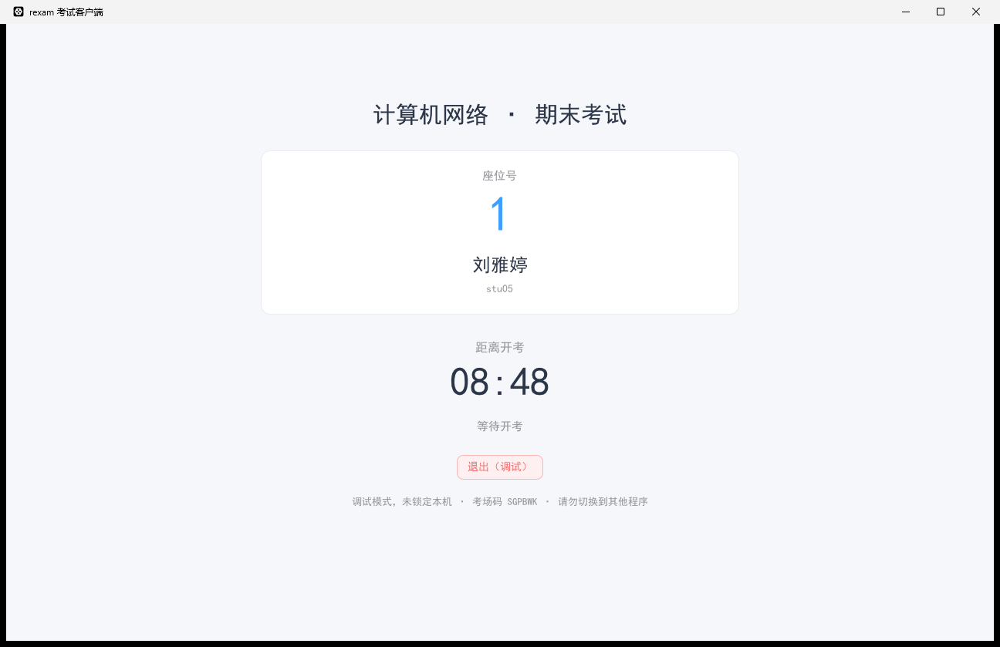
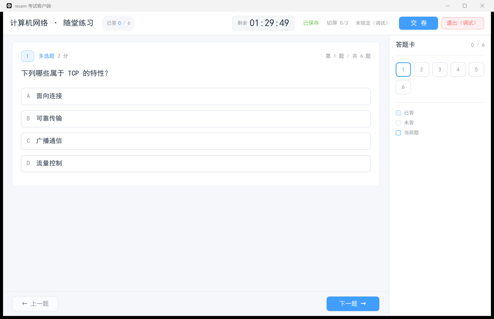
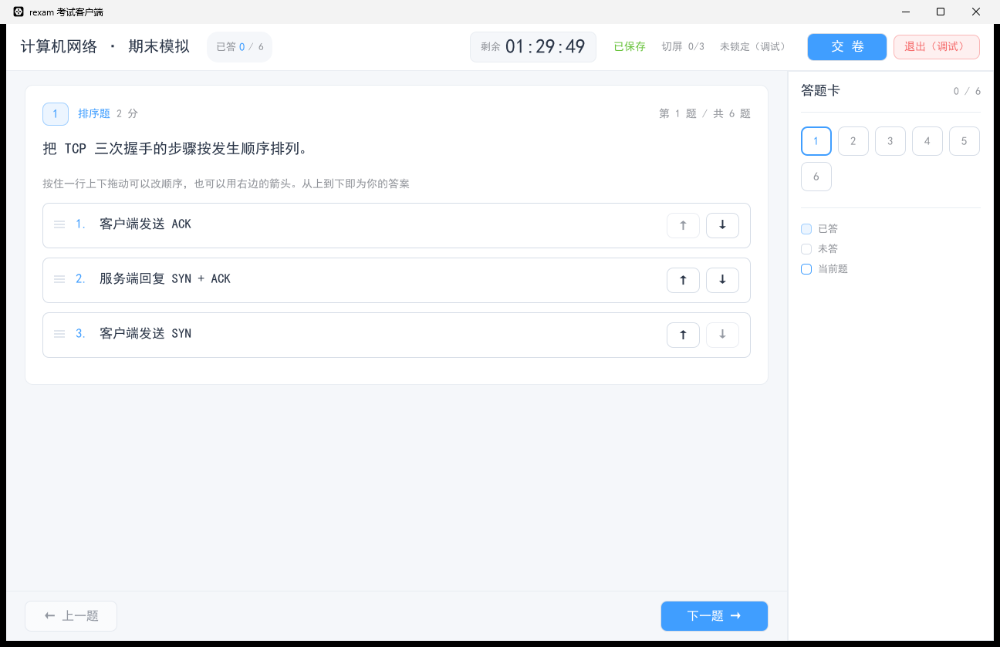
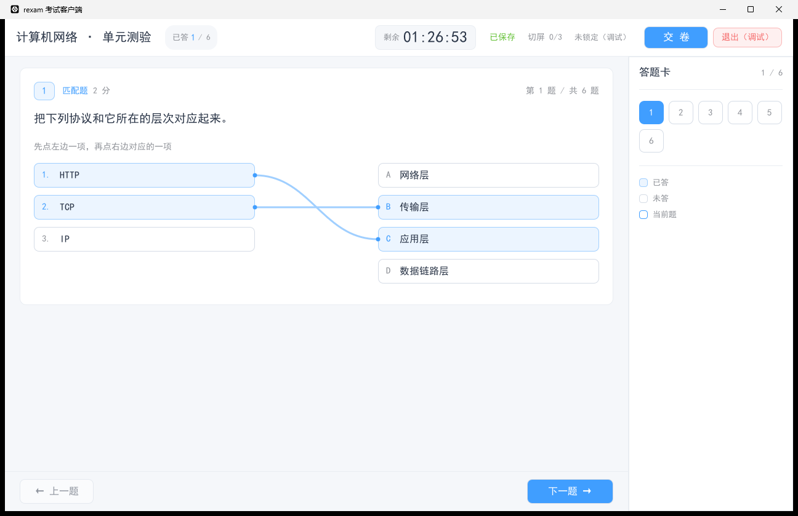
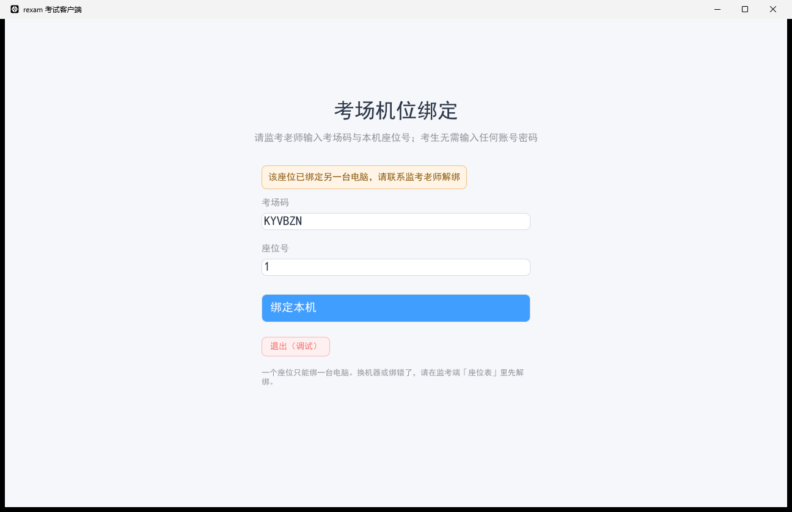

# rexam — Online Exam System (Binary Release)

[中文](README.md)

Online exam system in Rust: 8 question types, AI grading, power-loss recovery, plus a Windows
kiosk client where the seat is the identity — no login, auto-enter at start, full lockdown.

This repository ships **built artifacts only** — no source code. Everything here is ready to
deploy: a server binary, the compiled web frontend, and the Windows exam-room client.



## What's in the box

| Path | What it is |
|---|---|
| `server/rexam.exe` | Backend server, Windows x64. Serves the whole REST API. |
| `server/.env.example` | Configuration template. Copy to `.env` next to the binary. |
| `client/rexam-client.exe` | Exam-room client, Windows x64. Single file, no runtime needed. |
| `client/config.toml.example` | Client configuration template. |
| `web/` | Compiled frontend. Static files — serve with nginx or any web server. |
| `deploy/` | nginx site config and a systemd unit. |
| `docs/` | Proctor's manual (Chinese) and interface screenshots. |

## What it does

**Question bank** — single choice, multiple choice, true/false, fill-in-the-blank, numeric,
ordering, matching, and essay. Fill-in accepts several acceptable answers per blank; numeric
accepts a tolerance; ordering and matching options are shuffled per candidate.

**Papers** — fixed papers, or random papers drawn by category / type / difficulty so every
candidate gets a different set. You can dry-run the draw before publishing.

**Grading** — the first seven types are graded by rule. Essays (and fill-in answers that did not
score full marks) can go to a teacher, to an AI, or to the AI first with the teacher reviewing.
Any OpenAI-compatible endpoint works; DeepSeek and Qwen are pre-configured in the template.
The AI's original score is kept even after a teacher overrides it.

**Answers survive anything** — every answer is written to the server as it is typed. Power cut,
blue screen, network drop: the candidate logs back in and continues where they left off. The
countdown runs on server time, so it never resets and a wrong clock on the exam machine
does not matter.

**Proctoring** — seat assignment, per-seat device binding, live monitoring, forced submission,
time extension, tab-switch counting with automatic submission over the limit.

## The exam-room client

Candidates do not type an account or a password. Seats are assigned in advance; each machine
binds to its seat number on boot and polls the server. The moment the proctor starts the exam,
the server hands that seat's candidate their credentials and the client enters the paper by itself.

While the exam is running the screen is locked down: exclusive fullscreen, always on top, no
title bar, and a low-level keyboard hook that swallows `Win`, `Alt+Tab`, `Alt+Esc`, `Ctrl+Esc`,
`Ctrl+Shift+Esc`, `Alt+F4`, `Alt+Space` and `PrintScreen`. A watchdog reports and reclaims focus
the moment the window loses it. A stricter level additionally disables Task Manager and USB
storage and terminates blacklisted processes.

Two things it deliberately cannot do, stated plainly so nobody over-trusts it:

- **`Ctrl+Alt+Del` cannot be blocked.** It is the Windows Secure Attention Sequence and no
  low-level hook can see it. What the client does instead is record the lost focus and report it,
  then pull the window back when the candidate returns.
- **Hardware cheating is out of scope** — phones, notes, a second machine. The client makes
  software-level cheating leave a trail and become inconvenient. The rest is up to the proctor.

Every violation is only *reported*. Whether a candidate is auto-submitted is decided by the
server, never by the client — a judgement made on the candidate's own machine is not trustworthy.

Registry changes are restored to the value that was read before they were changed, including the
case where the key did not exist. A `Drop` guard covers the process being killed, so a machine is
never handed back with Task Manager still disabled.

|  |  |
|---|---|
|  |  |
|  |  |

## Running the server

You need **PostgreSQL 16+** and **Redis 6.2+** (6.2 is the floor — the flusher uses `LPOP key count`).

```bat
copy server\.env.example server\.env
:: edit .env: database URL, redis URL, and the two secrets below
server\rexam.exe
```

The server creates its own tables on first start and creates the initial administrator if the
user table is empty. It listens on `BIND_ADDR` (default `0.0.0.0:8080`).

> **Change these two before exposing the server to anyone.**
> `JWT_SECRET` — the template value is a placeholder, not a secret.
> `ADMIN_PASSWORD` — if you leave it unset the binary falls back to a **compiled-in default**,
> which means anyone who knows this project can log in as administrator.

### Serving the frontend

`web/` is a static bundle. Point nginx at it and proxy `/api` to the server — `deploy/nginx.conf`
does exactly that, including the history-API fallback the single-page app needs.

### A note on platforms

The server binary here is **Windows x64**, because that is what the build machine is. The systemd
unit in `deploy/` is for a Linux build and is included for reference. There is no Linux binary in
this release; producing one requires building from source on Linux (or with a cross toolchain).

## Deploying the exam-room client

Put `rexam-client.exe` and a `config.toml` in the same folder and add it to Startup.

```toml
server = "https://exam.example.com"
lock = "soft"              # soft needs no admin rights; hard also disables Task Manager and USB
room_code = "E86HDZ"       # this exam's room code, shown on the exam detail page
seat_no = 7                # different on every machine
exit_password = "set me"   # the proctor types this to quit; leave empty and anyone can quit
```

For imaging a lab, the seat number can come from the command line instead, one line per machine:

```bat
rexam-client.exe --server=https://exam.example.com --room-code=E86HDZ --seat-no=7
```

`config.toml.example` documents every option and what changing it affects. To quit, press
`Ctrl+Shift+Q` and enter the proctor password. With `lock = "off"` a visible exit button appears
instead — that mode is for testing and must never be used for a real exam.

On old machines without a GPU, or over remote desktop, set `low_graphics = true`. It turns off
anti-aliasing feathering, which is the bulk of the per-frame cost when rendering in software.

## Scale

The same build runs a twenty-person quiz and a twenty-thousand-seat sitting; only the number of
nodes changes. API nodes are stateless, answers are written to Redis and batch-flushed into
PostgreSQL by a background job, and submission is idempotent, so you can put as many nodes behind
nginx as you need. Measured on a four-core development box with the database co-located: 200
candidates submitting at once, graded, in 368 ms, with no answer lost.

## License

Not specified. Contact the repository owner before redistributing.
