# rexam — Online Exam System

[中文](README.md) · [Proctor's manual (Chinese)](docs/监考操作手册.md)

An exam system that covers the whole path from writing questions to publishing marks.
Eight question types, rule-based marking plus AI marking for free-text answers, and answers
that survive a power cut. It ships with a Windows exam-room client where **the seat is the
identity** — candidates type no username and no password. The proctor starts the exam and
every machine walks itself into the paper and locks the screen.

**This repository ships built artifacts only; the source is not open yet.** The system is still
being polished and will have rough edges that have not surfaced, so the code stays closed until it
settles. Unpack and deploy.

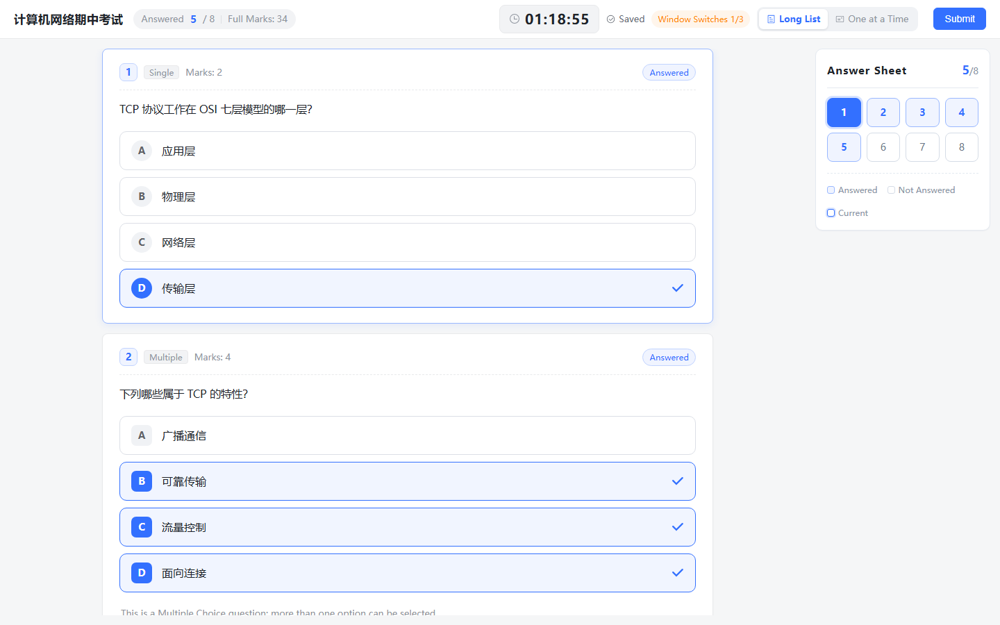

> **A note on language.** Both the web interface and the exam-room client speak English and
> Chinese. On the web there is a 中 / EN switch in the header and the choice is remembered per
> browser; the client takes `lang = "en"` in its config. Every screenshot on this page is the real
> English interface. Exam content — stems, options, candidate names — is always shown in whatever
> language it was written in, in either interface, so an English interface over a Chinese paper
> still shows a Chinese paper.

---

## The whole thing on one page

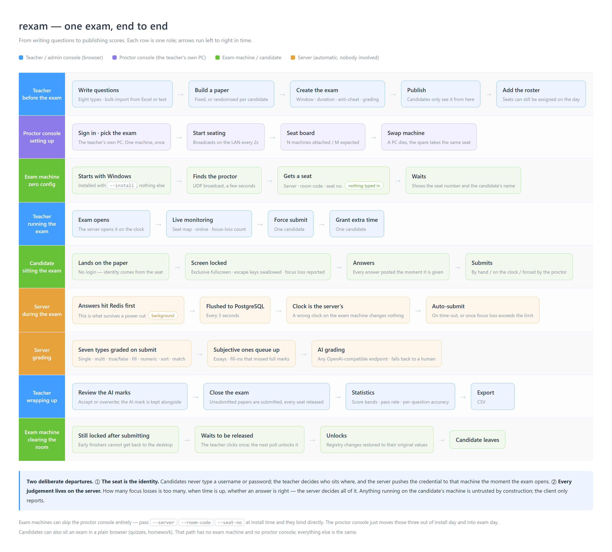

---

## Contents

- [The whole thing on one page](#the-whole-thing-on-one-page)
- [Who it is for](#who-it-is-for)
- [Two ways to sit an exam](#two-ways-to-sit-an-exam)
- [Questions and papers](#questions-and-papers)
- [Running and invigilating an exam](#running-and-invigilating-an-exam)
- [Marking and results](#marking-and-results)
- [System monitoring](#system-monitoring)
- [The exam-room client](#the-exam-room-client)
- [The invigilator console](#the-invigilator-console)
- [Deployment](#deployment)
- [Before you expose it](#before-you-expose-it)
- [Scale](#scale)
- [FAQ](#faq)
- [What is in this repository](#what-is-in-this-repository)

---

## Who it is for

One program covers three kinds of exam; the difference is which boxes you tick:

| Situation | How it is used |
|---|---|
| Quizzes and homework | Candidates open a browser on their own laptop or phone and sign in |
| Mid-term / final in a computer lab | Install the exam-room client; candidates never touch credentials |
| High-stakes exams | Client plus strict lockdown plus randomised papers — a different paper per candidate |

Three roles: **admin** manages accounts and the server, **teacher** writes questions, builds
papers, invigilates and marks, **candidate** sees only their own exams. Teachers cannot reach
user management or system monitoring; candidates cannot reach anyone else's paper.

## Two ways to sit an exam

**In a browser** — candidates sign in, open "My exams" and answer. Power cut, closed tab,
different device: they come back and carry on.

**On the exam-room client** — the lab machine starts the client at boot and binds itself to a
seat number. The candidate sits down and does nothing; when the proctor starts the exam, that
machine enters the paper as the candidate assigned to that seat. See
[the exam-room client](#the-exam-room-client).

| | |
|---|---|
| 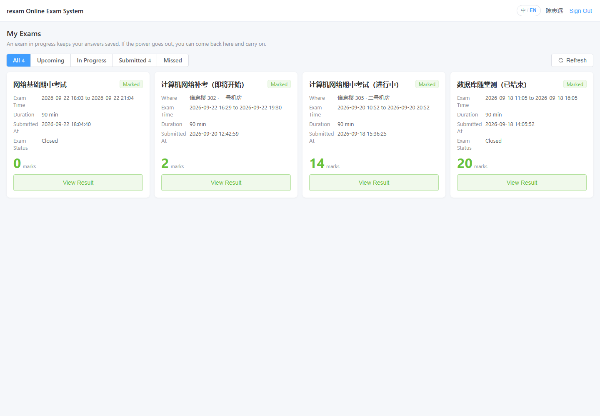 | 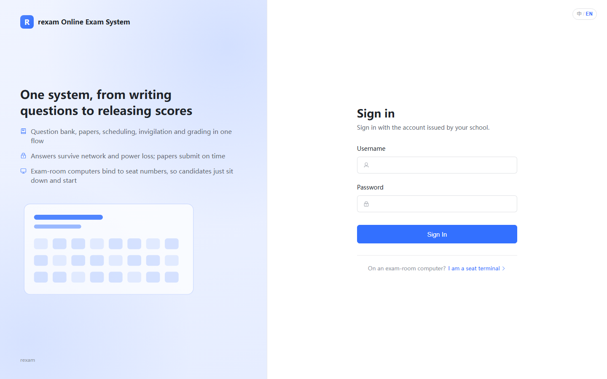 |

---

## Questions and papers

**Eight question types.** Every marking rule lives on the server; the client only collects
what the candidate typed or clicked:

| Type | Marking |
|---|---|
| Single choice | Full marks for the right option |
| Multiple choice | Full marks when exactly right; optionally half marks for a subset of the correct options. Any wrong option scores zero |
| True / false | Right or wrong |
| Fill in the blank | **Each blank accepts several synonymous answers**; any of them counts. Marks are split evenly across the blanks |
| Numeric | Supports a tolerance, e.g. 3.14 ± 0.01 |
| Ordering | Shuffled when shown; the whole order must be right |
| Matching | Marks per correct pair. The right column may be longer than the left — the extras are distractors |
| Free text | Marked by a teacher, by AI, or by AI first with a teacher confirming |

**Blanks are inserted with a button.** Click "insert a blank at the cursor" and the stem gets a
blank, the answer list gets a row, and the preview shows ①②③ exactly as the candidate will see
it. Nobody types underscores by hand, so nobody discovers at save time that they drew three
lines and filled in two answers.

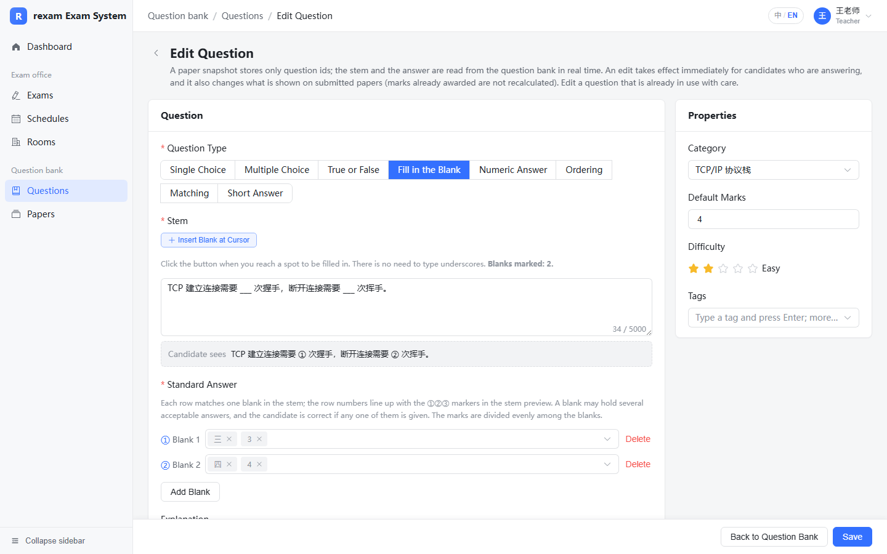

**Two ways to build a paper:**

- **Fixed** — pick questions from the bank, set marks per question, everybody gets the same paper.
- **Randomised** — write a few rules (category, type, difficulty range, how many to draw, marks
  each) and **every candidate gets a different set**. Hit "save and draw a trial paper" before
  publishing: if the bank is too small it tells you how many questions are missing, right then,
  instead of on exam day when candidates cannot get in.

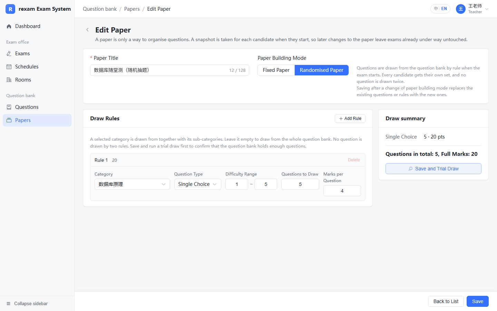

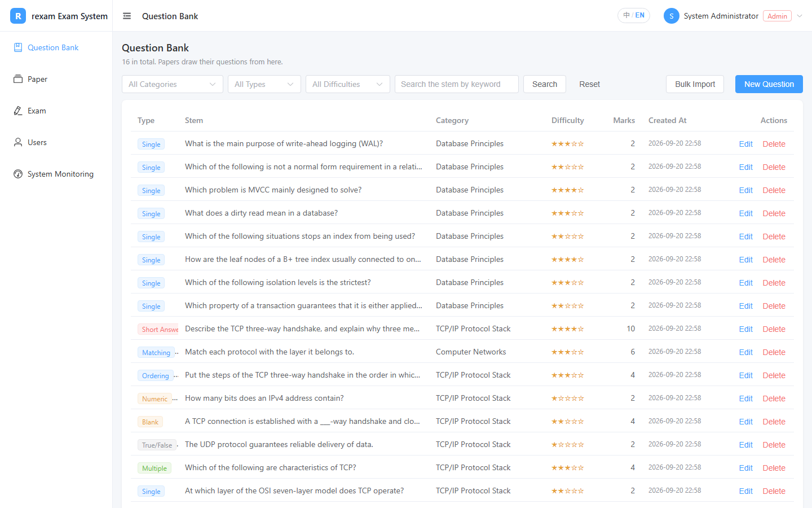

### Bulk import: three ways in, one way through

Nobody types two hundred questions by hand. Three sources, all of which end up in the same
preview table, and **nothing reaches the database until you press Import**:

| Source | How it works |
|---|---|
| **Spreadsheet** | Pick an Excel (.xlsx) or CSV file. One question per row; column names are matched in English or Chinese, and the dialog will hand you a template. All eight types are supported |
| **Text (AI)** | Paste questions straight out of Word and the AI turns them into drafts |
| **JSON** | The original format, still there for scripted imports |

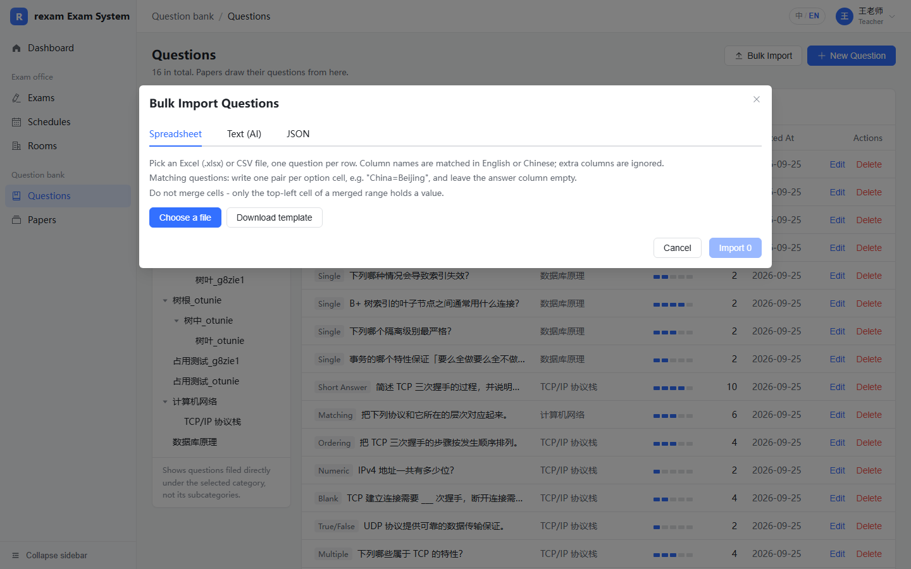

The spreadsheet is parsed in the browser — the file never reaches the server. GBK-encoded CSV
(what WPS exports by default), title rows above the header, and gaps in the columns are all
handled. When a row cannot be imported, the reason sits on that row: "the answer refers to C,
which has no option" is worth rather more than "import failed".

If the column names do not match the template, do not go back and edit the header — press
"Let the AI sort it out" and the whole sheet goes to the model.

> **Anything the AI produces lands in the preview table first, and only an explicit Import writes
> it to the database.** The model will invent answers; this step is not optional. If the server
> has no AI configured, the tab says so outright instead of spinning.

---

## Running and invigilating an exam

Creating an exam sets three things: the **window** (nobody gets in outside it), the **duration**
(counted from when each candidate starts), and a row of anti-cheating switches. A candidate's
deadline is the earlier of "their start time plus the duration" and "the end of the window".

An exam is a draft, published, or closed. A draft never reaches candidates; publishing is what
makes it appear under a candidate's "My exams"; closing it force-submits every paper still
outstanding.

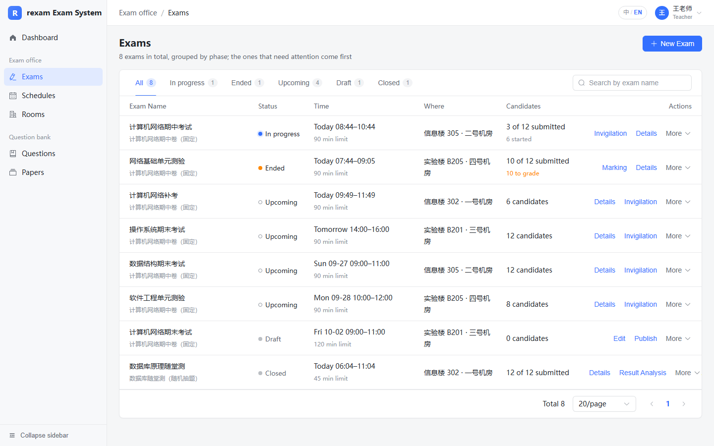

Each exam has a **six-character room code**; exam-room machines use it plus a seat number to
place themselves. The code can be reset at any time, and the reset can unbind every machine in
the room at once — if a room code leaks, changing the code alone is not enough.

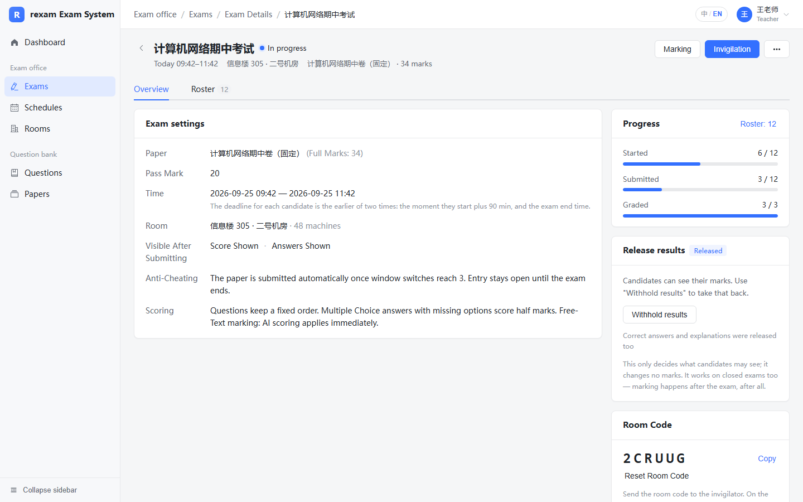

The **invigilation page** shows every seat live: no candidate assigned, no machine bound,
waiting to start, answering, disconnected, submitted — plus how many times each candidate has
switched away from the window. There is a seat-map view and a list view. A teacher can
**force-submit** or **grant extra time** for one candidate, or close the whole exam.

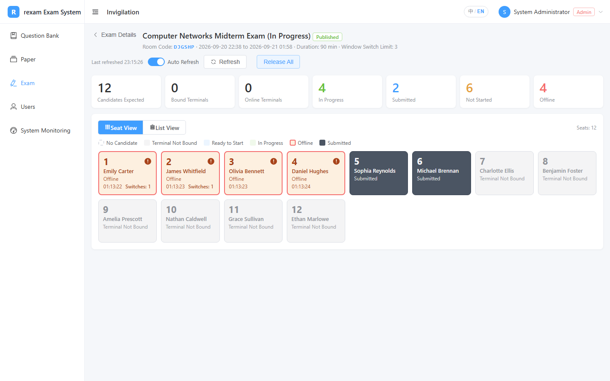

**Answers do not get lost.** Every answer is written back to the server as it is given: into
Redis first, then flushed into PostgreSQL in batches by a background job. After a power cut, a
blue screen or a dropped network the candidate resumes exactly where they were. The countdown
runs on **server time**, so a wrong — or deliberately altered — clock on the exam machine
changes nothing.

---

## Marking and results

The first seven types are marked the moment the paper is submitted. Free-text answers, and
fill-in-the-blank answers that did not score full marks by rule, go through one of three routes:

- **Teacher** — mark each answer, optionally with a comment.
- **AI** — the AI's mark is taken as final.
- **AI first, teacher confirms** — the AI gives a mark and a short explanation against the mark
  scheme; the teacher accepts it with one click or overrides it. **The AI's original mark is
  kept**, so the two can always be compared.

AI marking talks to any **OpenAI-compatible endpoint**; the config template ships DeepSeek and
Qwen settings. Failed requests are retried, and when the retries run out the answer is handed to
a human rather than quietly scored zero. Write the mark scheme into the question's "explanation"
field (e.g. "2 marks for each of the three steps, 2 marks for mentioning duplicate historical
connections") — the AI reads it, and the more specific it is the closer the marks land. Humans
mark against it too.

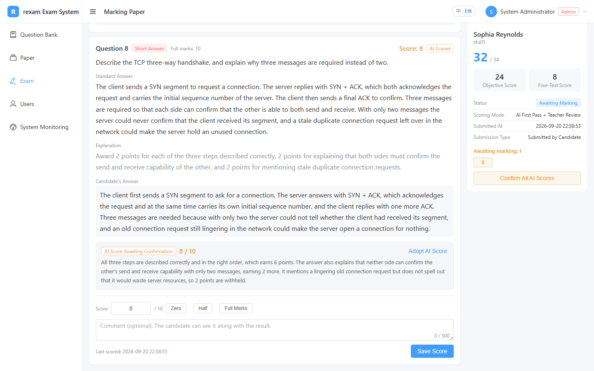

Afterwards there are **statistics**: mean, highest and lowest, pass rate, the distribution across
score bands, and **the success rate per question** — the worst questions sort to the top, so it
is obvious which ones to go over in class. Results export.

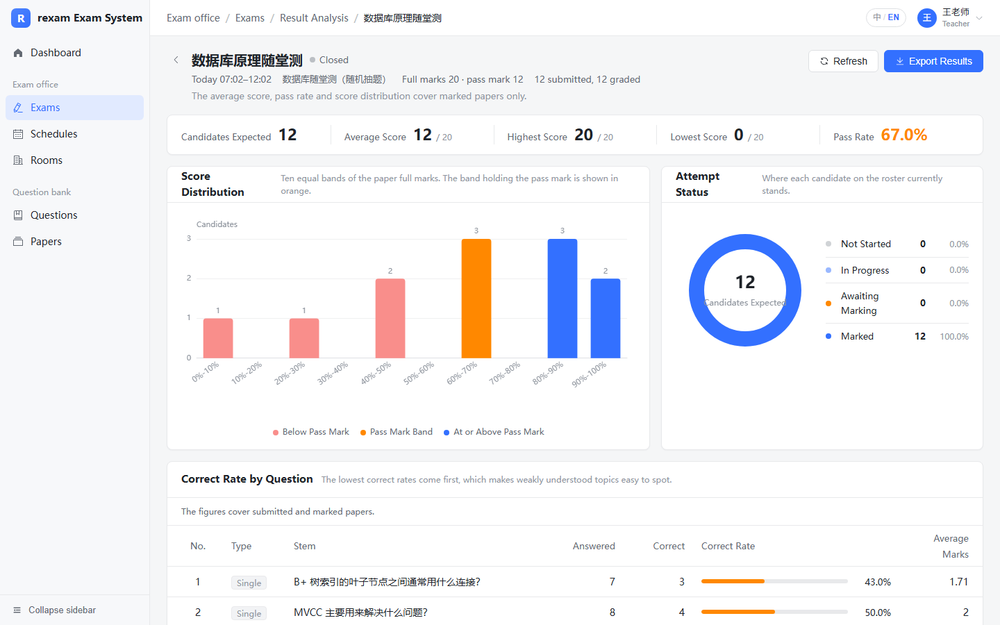

Whether candidates may see their mark, and whether they may see the answers, is decided per exam.
The client never overrides that.

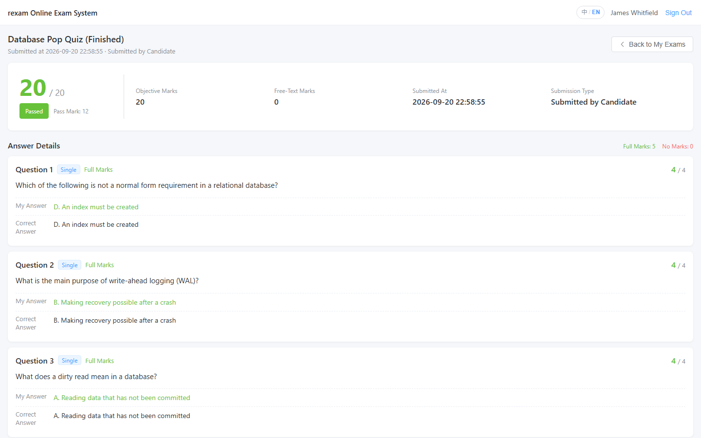

---

## System monitoring

Admins see the live state of this API node: CPU, memory, disk and swap; PostgreSQL and Redis
response times and pool usage; the heartbeat and lifetime throughput of the four background
jobs; current load; and the AI marking queue with its success and failure counts.

**The thresholds live on the server**, and the page only renders the conclusion — a line like
"disk 97% full; once it fills, the database stops accepting writes" comes from the server, so
any other client reading the same endpoint reaches the same conclusion.

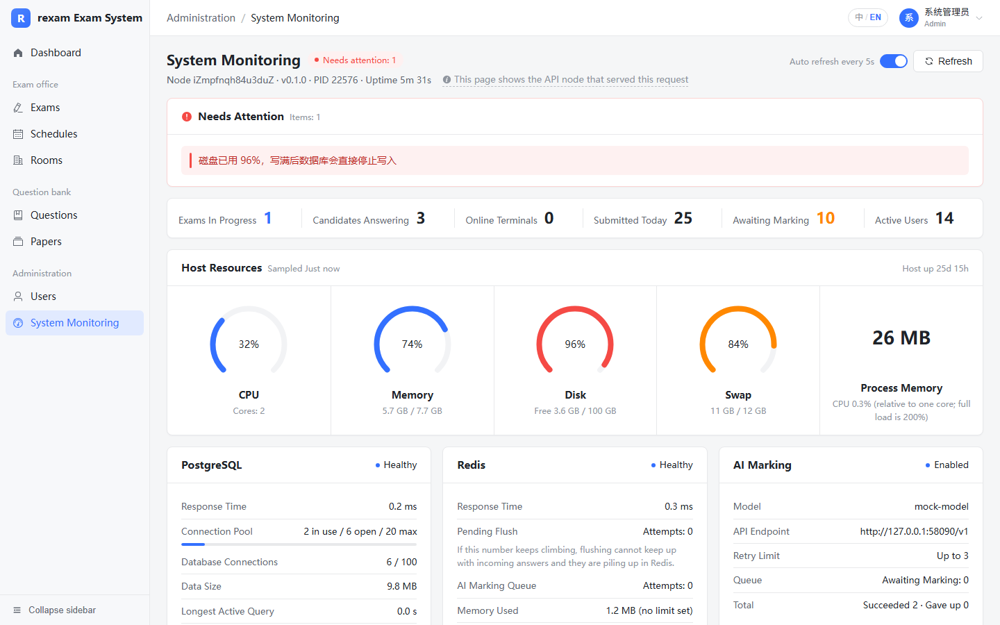

One detail worth spelling out: **a stopped heartbeat and "nothing to do" are different things.**
The flush job ticks every 3 seconds whether or not there are answers waiting; if its heartbeat
goes quiet for more than four times its interval it is flagged as stalled. That is what tells
"idle" apart from "dead".

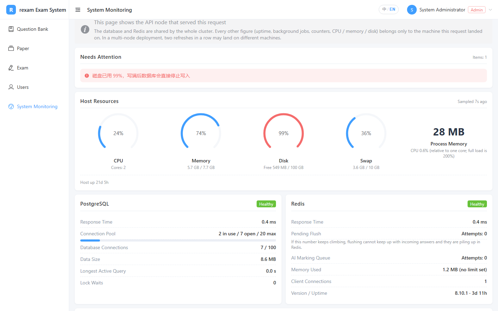

> The numbers on this page describe **this API node only**. The database and Redis are shared by
> the whole cluster; everything else (uptime, background jobs, counters, CPU / memory / disk)
> belongs to whichever machine served the request.

---

## The exam-room client

Windows x64, a single exe, no runtime to install, no browser involved. Set `lang = "en"` and
the whole interface is English, as in the screenshots below.

**Candidates type nothing.** Seats are assigned in advance; the machine binds itself to its seat
number at boot and starts polling. When the proctor starts the exam, the server hands down the
credential for the candidate in that seat and the client walks into the paper.

| | |
|---|---|
| 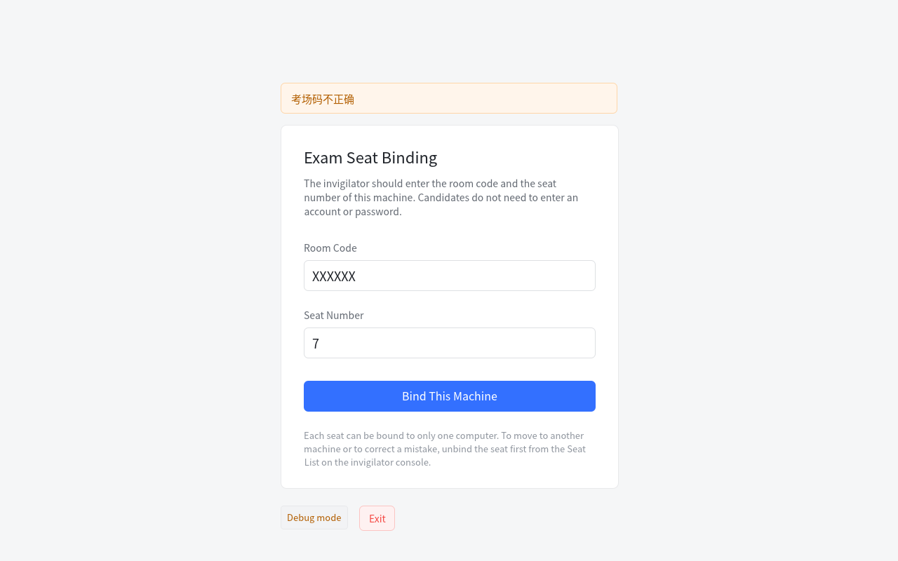 | 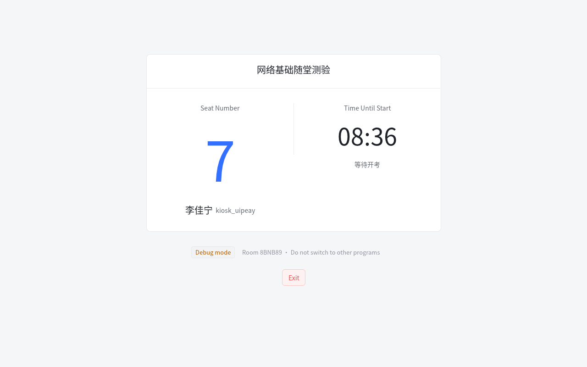 |

During the exam the screen is locked down: exclusive fullscreen, always on top, no title bar,
and a low-level keyboard hook that swallows `Win`, `Alt+Tab`, `Alt+Esc`, `Ctrl+Esc`,
`Ctrl+Shift+Esc`, `Alt+F4`, `Alt+Space` and `PrintScreen`. The moment the window loses focus a
watchdog reports it and pulls the window back to the front. The stricter tier also disables Task
Manager, disables USB mass storage, and kills blacklisted processes.

All eight question types are drawn natively — this is not a browser in a box. Matching questions
draw real curves between the columns; ordering rows move out of the way while you are still
dragging, not after you let go; the tick and the cross on true/false questions are vector
drawings (no Chinese system font contains ✓ or ✗ — using the characters would render two tofu
boxes).

| | |
|---|---|
| 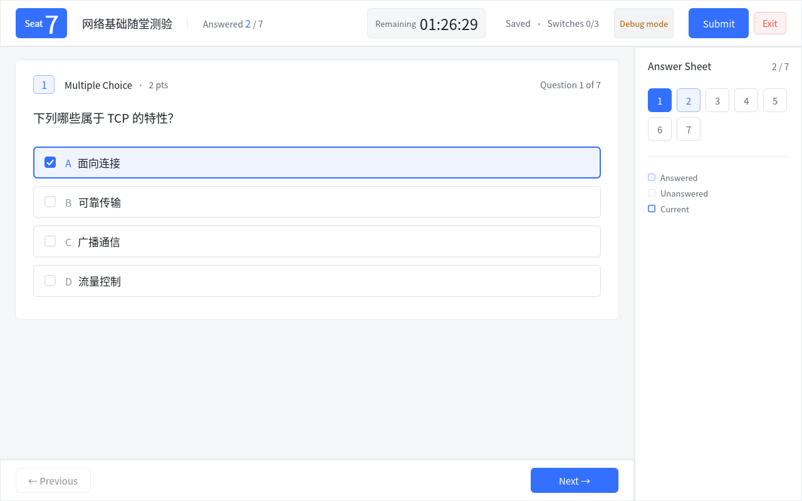 | 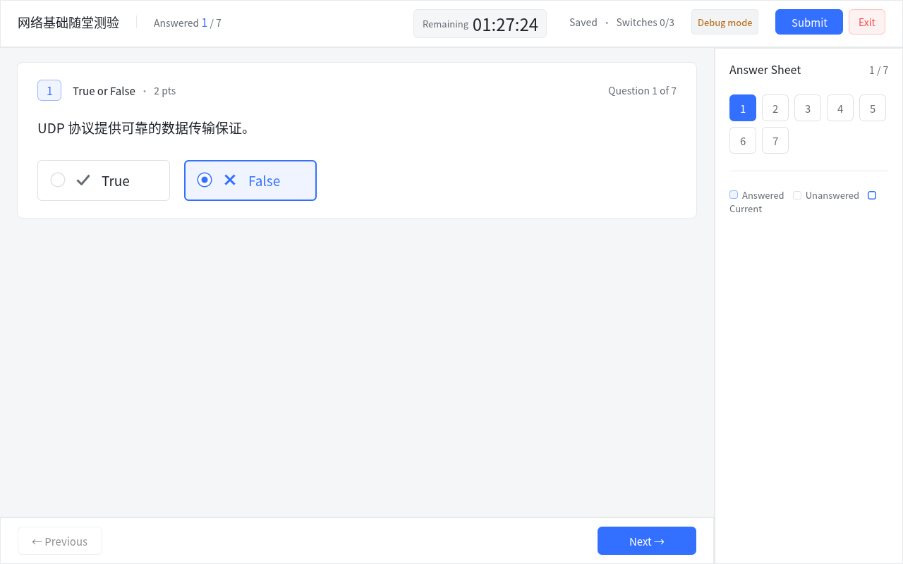 |
| 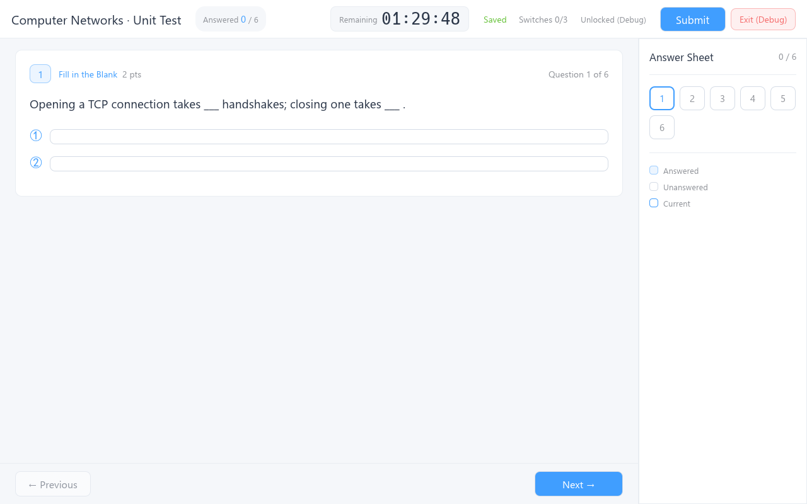 | 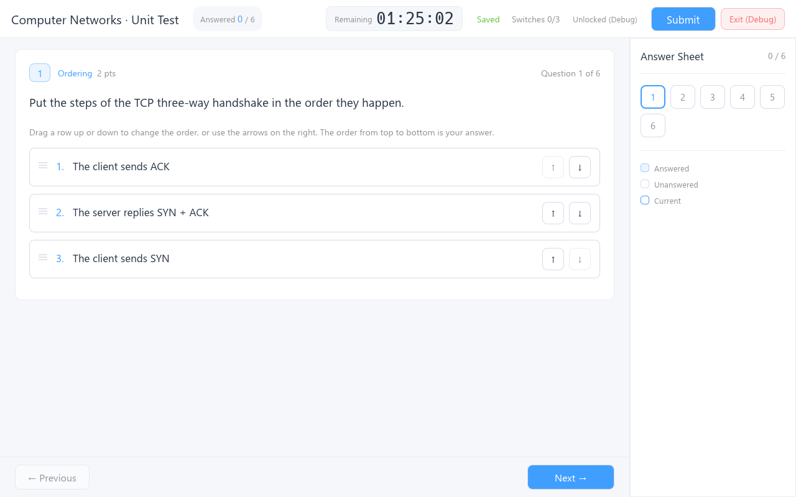 |
| 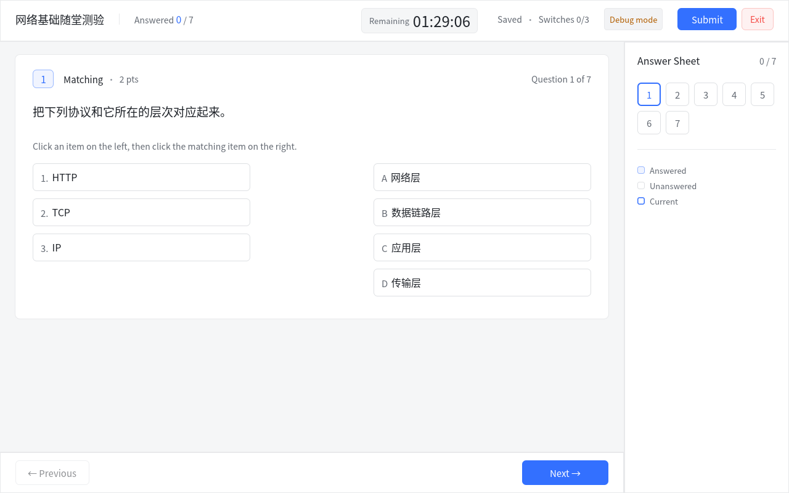 | 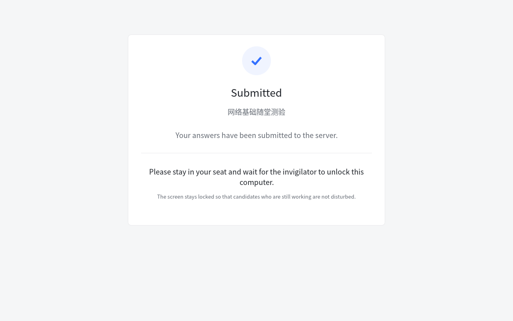 |

On the question palette, **filled means answered and hollow means unanswered** — never green.
Nothing has been marked yet, and a candidate reads green as "I got that one right".

## The invigilator console

A small program that runs on **the teacher's own computer** (`proctor/rexam-proctor.exe`).
Its only purpose is to make exam machines need no configuration at all.

Three steps for the teacher: **sign in, pick a published exam, press "start"**. From then on it
broadcasts "I am here" on the LAN every two seconds; each exam machine hears it at boot and
connects, and the console uses the teacher's credentials to claim a seat from the server for that
machine, handing back which server, which exam and which seat number.

The screen shows **"N attached / M expected"** plus each machine's seat number, hostname and IP.
That count is the setup progress: sixty machines booted should read 60/60. At the end, press
"Release All".

It **does not mark, does not compute deadlines, and does not decide who sits where** — the seat
assignment is a call to the server. Marking and timing rules exist in exactly one place, the
server; a second implementation in the console would only guarantee the two disagree eventually.

### What it deliberately does not do

- **You can run an exam without it.** Machines installed with `--server`, `--room-code` and
  `--seat-no` still bind directly; the console just moves those three from install time to exam time.
- **Exam machines still talk to the server themselves.** The console never relays exam traffic, so
  closing it mid-exam does not disturb anyone who is already working.
- **It cannot collect papers in a room with no internet.** That needs offline exam packs, locally
  issued candidate credentials, question text inside the pack and on-disk answer buffering — each
  its own design, none of it built yet.

### What must be open on the LAN

| | Port | Listener |
|---|---|---|
| Discovery | UDP 45301 | both sides (broadcast + multicast 239.255.73.77) |
| Setup | TCP 45300 | the console |

If a machine finds the console but cannot connect, it is **almost always the firewall on the
teacher's computer blocking inbound connections** — outbound broadcast still goes out, so it looks
a lot like "cannot find it". The exam machine says so on screen in as many words.

### On trust

LAN discovery is plain UDP and **anyone can broadcast a fake beacon**. So:

- a beacon is only a hint, and it carries **no IP** — the address is always taken from the UDP
  source, otherwise one forged packet could point a whole room at any host;
- a machine installed with `--server` accepts only that address, so a fake console cannot redirect it;
- if the teacher's "N attached / M expected" does not add up, machines went somewhere else.

This step has **no TLS and no key pinning**. The threat model reaches "wrong configuration and
slips of the hand", not "an active attacker on the same segment". Saying so beats implying otherwise.

### Letting candidates leave

**The invigilator decides, not the machine in front of the candidate.**

After a paper is submitted the screen stays locked — someone who finishes early should not get back
to the desktop while others are still working. The teacher releases the seat from the invigilation
page and that machine unlocks on its next poll (3 seconds by default). At the end, **closing the
exam** releases every seat in the room at once, so nobody has to walk the aisles clicking.

That is why no proctor password is needed per machine — and a password stored on a machine the
candidate can reach was never much of a lock anyway. `exit_password` still exists as an **offline
fallback**, for when the server is unreachable and a machine has to be freed anyway. Leave it empty
and the finish screen shows no password box at all.

> To release one machine **mid-exam** (a candidate taken ill, say), force-submit first and then
> release. Collecting the paper and letting the person go are two different decisions.

### About Ctrl+Alt+Del

**The key combination itself cannot be intercepted.** It is Windows' secure attention sequence,
handled by Winlogon, and a low-level keyboard hook is designed not to reach it — that is the
mechanism which guarantees the screen you get really did come from the system. It is not an
oversight to work around.

So hard lockdown takes a different route: **if the screen cannot be blocked, leave nothing on it
to click.** Task Manager, Lock, Change a password, Sign out and Switch user are each disabled, so
a candidate who presses it sees a screen of greyed-out options, presses Esc and comes back — and
the lost focus has already been recorded and reported by the watchdog. Four of those five settings
live under `HKCU`, so **no administrator rights are needed**; the candidate's own account is enough.

Blocking the screen outright is only possible with Windows' **Keyboard Filter** (an optional
feature of Enterprise and IoT Enterprise). On a machine that has it, turn on `block_sas`. It is off
by default because it is a **machine-level** switch restored when the client exits: if the client is
killed (power cut, process ended from another account) it will not be restored, and that machine
will refuse `Ctrl+Alt+Del` from then on with nothing to explain why. Confirm the restore works on
one machine before rolling it out.

### What it still cannot do

**Nothing about hardware** — phones, notes, a second device. The client makes software-level
cheating leave a trace and become inconvenient; the rest is the proctor walking the room. Saying so
is better than letting anyone overestimate it.

Every violation is **reported, never judged locally**. How many switches count as too many, and
whether that forces a submission, is decided by the server — a judgement made on the candidate's
own machine is not trustworthy in the first place.

Registry values the client changes are restored on exit to **the value that was read before the
change**, including the case where the value did not exist. There is a fallback for a killed
process too, so a machine is never handed back to the lab with Task Manager still disabled.

### Installing on an exam machine

**One command, with no arguments at all:**

```bat
rexam-client.exe --install
```

It writes `config.toml` itself and registers itself to start at boot (a Run entry under `HKCU`, so
no administrator rights), then exits. A deployment script loops over the machines and is done;
`--uninstall` removes the autostart entry.

**Server address, room code and seat number are all left blank.** The teacher opens the
**invigilator console** on their own machine, signs in and picks an exam; each exam machine finds
it on the LAN at boot and collects all three. See [The invigilator console](#the-invigilator-console).

**No password either.** Letting candidates go is done from the invigilation page: the teacher
releases the seat and the unlock travels down to the machine. Nothing is typed on the exam
machine itself.

> **For high-stakes exams, pin the server:**
>
> ```bat
> rexam-client.exe --install --server=https://exam.example.com
> ```
>
> With that, the machine accepts only this address and ignores whatever the console hands down.
> The value is **the same on every machine in the school** — it is not per-machine work, a
> deployment script writes it once. Why bother: LAN discovery is plain UDP and anyone can
> broadcast a fake beacon. Once pinned, a fake console can at worst stop the machine connecting;
> it cannot redirect it.

**The seat number is optional**: without `--seat-no` the machine stops at the binding screen for the
invigilator to type the room code and seat once. Rooms with a fixed seating chart keep passing
`--seat-no=7` per machine.

If you would rather write the config by hand, put `config.toml` next to the exe:

```toml
server = "https://exam.example.com"
lock = "soft"                  # soft needs no admin rights; hard also disables Task Manager and USB storage
lang = "en"                    # client UI language: "zh" (default) or "en"
room_code = "E86HDZ"           # this exam's room code, shown on the exam details page
seat_no = 7                    # different on every machine
exit_password = ""             # offline fallback only; most rooms leave this empty
```

`lang` switches the client's own wording between Chinese and English. It does not touch the
exam itself: stems, options, candidate names and anything else the server sends down are the
author's content and are shown exactly as written. An English interface over a Chinese paper
stays a Chinese paper.

For mass deployment the seat number can come from the command line, one line per machine:

```bat
rexam-client.exe --server=https://exam.example.com --room-code=E86HDZ --seat-no=7 --lang=en
```

`config.toml.example` documents what each setting changes. Setting `lock = "off"` puts an exit
button right on screen — that is
for debugging and must never be used in a real exam. (The client screenshots above were taken in
debug mode, which is why there is an "exit (debug)" button in the corner.)

On machines with no discrete GPU, or over remote desktop, turn on `low_graphics`. It disables
anti-aliased feathering, which is the bulk of the per-frame cost in a pure software renderer.

> You can run an exam without the client: open `/seat` in a browser, enter the room code and seat
> number, and the machine works as a seat terminal. It cannot stop window switching, so it suits
> lower-stakes settings.
>
> 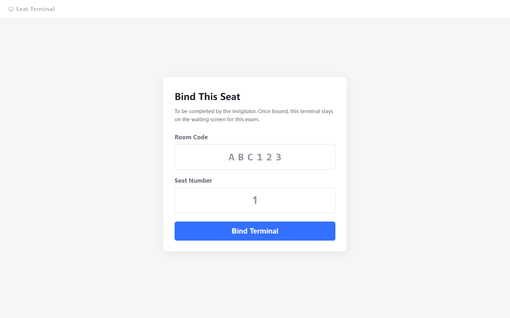

---

## Deployment

Requires **PostgreSQL 16+** and **Redis 6.2+** (6.2 is the floor — the flush job uses
`LPOP key count`).

```bat
copy server\.env.example server\.env
:: edit .env: database URL, Redis URL, and the two settings called out below
server\rexam.exe
```

The first start creates the schema, and creates an initial admin when the user table is empty.
`BIND_ADDR` decides where it listens; the default is `0.0.0.0:8080`.

**The frontend** is the pile of static files under `web/`. Point nginx at it and reverse-proxy
`/api` to the server. `deploy/nginx.conf` does exactly that, including the deep-link fallback a
single-page app needs.

**On platforms**: the server here is a **Windows x64** build, because the build machine is
Windows. The systemd unit under `deploy/` is for a Linux build and is included for reference.
**This release has no Linux binary** — for that you need to build from source on Linux, or with a
cross toolchain.

## Before you expose it

These two must be changed:

- **`JWT_SECRET`** — the string in the template is a placeholder, not a secret.
- **`ADMIN_PASSWORD`** — if you leave it unset the program falls back to a **compiled-in
  default**, which means anyone who knows this project can sign in as admin.

Two more suggestions: do not expose the database or Redis to the internet, and put the server
behind nginx over HTTPS so the client and the browser use the same hostname.

Passwords are stored with argon2, API auth is JWT, and role checks run per endpoint on the
server — hiding a menu in the frontend does not stop anyone calling the API directly, so nothing
relies on that.

## Scale

The same program runs a twenty-person quiz and a twenty-thousand-person exam; the difference is
how many machines you give it. API nodes are stateless, answers land in Redis and are flushed to
PostgreSQL in batches, and submission is idempotent, so you can put as many nodes behind nginx as
you like.

Measured on a four-core dev box with the database on the same machine: **200 candidates
submitting at once, marked to completion in 368 ms, nothing lost.**

## FAQ

**A candidate lost power mid-exam. Now what?**
They boot up and carry on. Everything already answered is there, and the countdown continues on
server time — it neither resets nor hands out extra minutes.

**Can the exam room be offline?**
Yes. Put the server, the database and the frontend on machines inside the LAN and point the
client at the internal address. AI marking needs internet access; if you are not using it, turn
it off and free-text answers go to teachers.

**Can every candidate get different questions?**
Use a randomised paper. Rules draw by category, type and difficulty, and no candidate draws the
same question twice.

**Will the window-switch counter produce false positives?**
Yes. On some machines a system notification is enough to steal focus. Set the limit to 3–5 rather
than 1. Zero means unlimited — switches are still recorded, they just do not force a submission.

**What if the AI marks something wrong?**
Use "AI first, teacher confirms". The teacher edits the mark and the AI's original mark stays on
record for comparison.

**Can teachers see each other's questions?**
They share the question bank and the papers, but user management and system monitoring are
admin-only.

## What is in this repository

| Path | What it is |
|---|---|
| `server/rexam.exe` | Backend service, Windows x64. The whole REST API. |
| `server/.env.example` | Config template. Copy to `.env` next to the executable. |
| `client/rexam-client.exe` | Exam-room client, Windows x64. One file, no runtime. |
| `client/config.toml.example` | Client config template; every setting says what changing it does. |
| `proctor/rexam-proctor.exe` | Invigilator console, Windows x64. Runs on the teacher's own computer; it is what lets exam machines need no configuration. |
| `web/` | Compiled frontend — static files for nginx or any web server. |
| `deploy/` | nginx site config and a systemd unit. |
| `docs/监考操作手册.md` | End-to-end manual for teachers (Chinese), no technical background needed. |
| `docs/screenshots/` | The screenshots above. |

Stack: Rust on the server (axum, tokio, sqlx, redis), Vue 3 + Vite + Element Plus on the web, and
Rust + egui for the natively drawn exam-room client.

## On open source

**The source is not published yet.** The system is still being polished and certainly still has
rough edges that have not surfaced; opening the code now would mostly help people run a real exam
on something that is not ready. It will be opened once it has settled.

What this repository ships is the deployable build — server, frontend and exam-room client. It is
the complete thing, not a trial. Issues are welcome.

## Licence

Unspecified. Please contact the repository owner before redistributing.
