# rexam 在线考试系统

[English](README.en.md) · [监考操作手册](docs/监考操作手册.md)

一套从出题到出分的考试系统。八种题型、规则判分 + AI 判主观题、断电续答；
另配一个 Windows 考场客户端——**座位即身份，考生不输账号密码**，监考老师一点开考，
机器自动进入答题页并锁屏。

**本仓库只放编译好的产物，暂不开源代码。** 系统还在完善，难免有没暴露出来的问题，
等稳定之后再把源码放出来。下载解压就能部署。

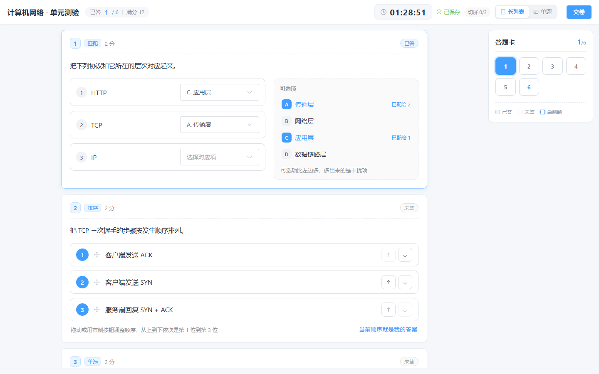

---

## 一张图看完整个流程

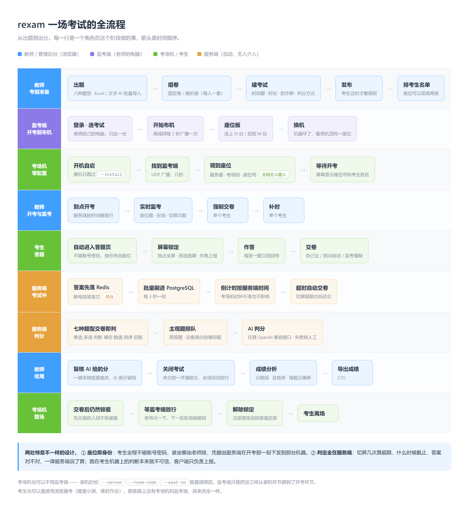

---

## 目录

- [一张图看完整个流程](#一张图看完整个流程)
- [它适合什么场景](#它适合什么场景)
- [两种考法](#两种考法)
- [出题与组卷](#出题与组卷)
- [考试与监考](#考试与监考)
- [判分与成绩](#判分与成绩)
- [系统监控](#系统监控)
- [考场客户端](#考场客户端)
- [监考端](#监考端)
- [部署](#部署)
- [对外开放之前](#对外开放之前)
- [规模](#规模)
- [常见问题](#常见问题)
- [仓库里有什么](#仓库里有什么)

---

## 它适合什么场景

同一套程序覆盖三种考法，区别只在考试设置里勾什么：

| 场景 | 怎么用 |
|---|---|
| 随堂小测、课后作业 | 考生用自己的电脑或手机开浏览器，登录做题 |
| 期中期末机考 | 机房统一开考，装考场客户端，考生不接触账号密码 |
| 高利害统考 | 客户端 + 严格锁定 + 随机卷，每人一套不同的题 |

三个角色：**管理员**管账号和服务器，**教师**出题、组卷、监考、批改，**考生**只看到自己的考试。
教师看不到用户管理和系统监控，考生看不到任何别人的卷子。

## 两种考法

**浏览器**——考生自己登录，进入「我的考试」，点开就答。断电、关标签、换设备，回来接着答。
界面支持中英文，顶栏有个「中 / EN」开关，选了之后这台浏览器记住。

**考场客户端**——考场电脑开机自启，绑到座位号上；考生坐下什么都不用做，老师一点开考，
这台机器自动用这个座位对应考生的身份进入答题页。详见 [考场客户端](#考场客户端)。

| | |
|---|---|
| 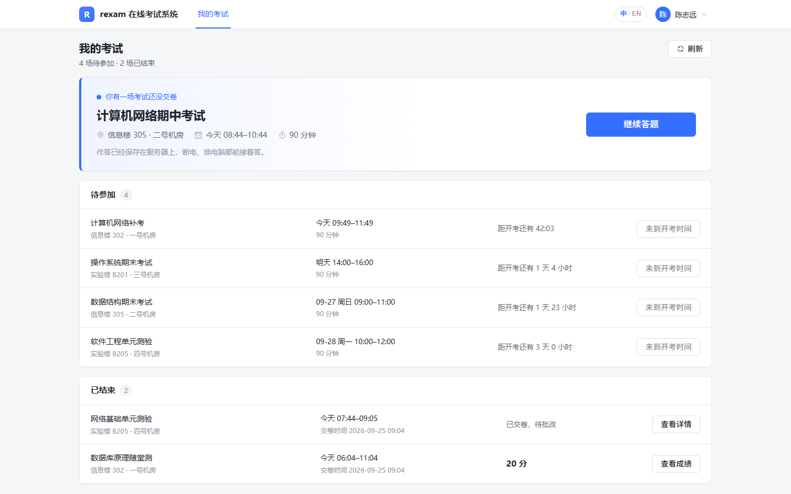 | 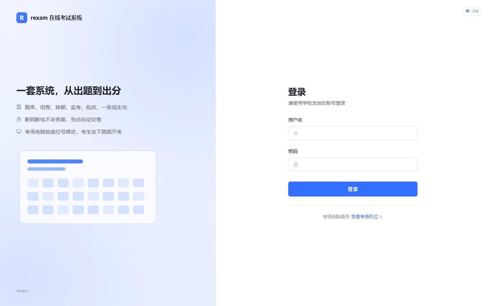 |

---

## 出题与组卷

**八种题型**，每种的判分规则都写死在服务端，客户端只负责收集作答：

| 题型 | 判分 |
|---|---|
| 单选 | 选对得满分 |
| 多选 | 全对得满分；可选「漏选给一半分」，错选一律 0 分 |
| 判断 | 对错 |
| 填空 | **每个空可以配多个同义答案**，答中任意一个算对；总分按空数平均分 |
| 数值 | 支持误差范围，比如 3.14 允许 ±0.01 |
| 排序 | 展示时打乱，顺序全对才得分 |
| 匹配（连线） | 按连对的组数给分；右栏可以比左栏多，多出来的是干扰项 |
| 简答 | 交给教师 / AI / AI 初判 + 教师复核，三选一 |

**填空题的空由按钮插入。** 点「在光标处插入空位」，题干里就多一个空，
下面自动多一行答案，预览里用 ①②③ 标出考生会看到的样子。
不用自己敲下划线，也就不会出现「敲了三条线只填了两个答案」这种存盘才发现的错。

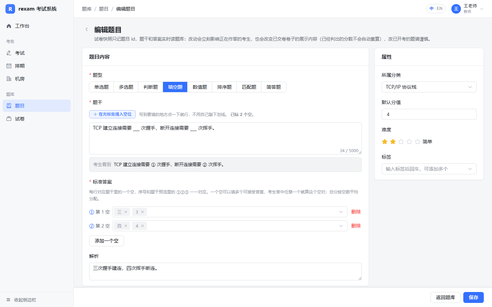

**组卷两种方式：**

- **固定卷**——从题库挑题、逐题设分值，所有考生同一份。
- **随机卷**——写几条规则（分类、题型、难度区间、抽几道、每题几分），
  **每个考生抽到的题都不一样**。发布前点「保存并试抽」，题库不够会当场告诉你缺多少道，
  而不是等到考试当天考生进不去。

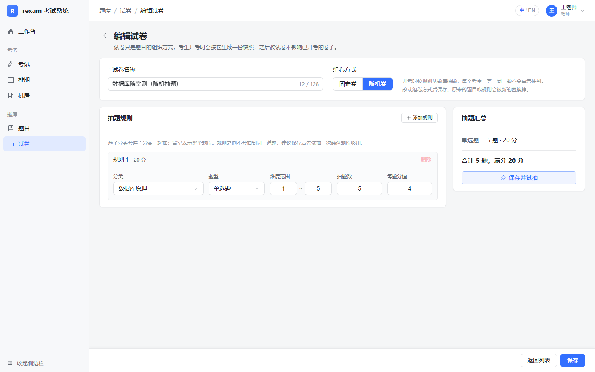

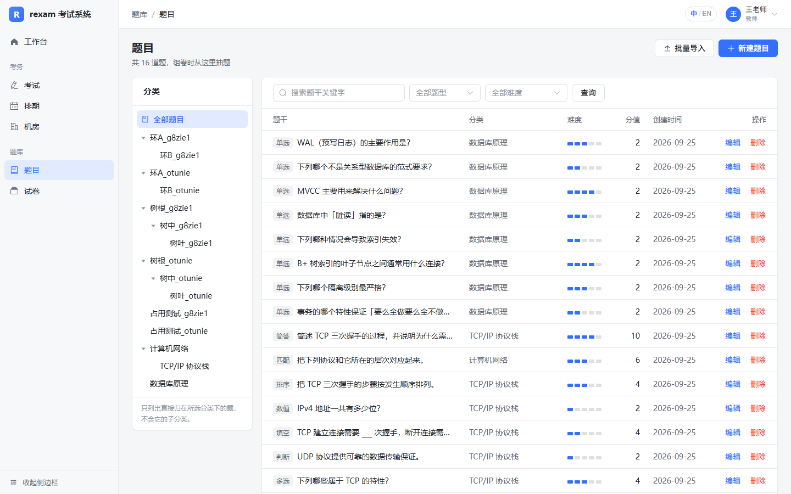

### 批量导入：三条路，一个出口

题目多的时候不用一道道敲。三种来源，最后都落到同一张预览表上，
**确认无误再入库**：

| 来源 | 怎么用 |
|---|---|
| **表格** | 选一个 Excel（.xlsx）或 CSV。一行一题，列名中英文都认，界面上可以下载模板。八种题型都支持 |
| **文字（AI）** | 把 Word 里复制出来的题目直接粘进去，AI 整理成题目草稿 |
| **JSON** | 老格式保留，接口对接时用得上 |

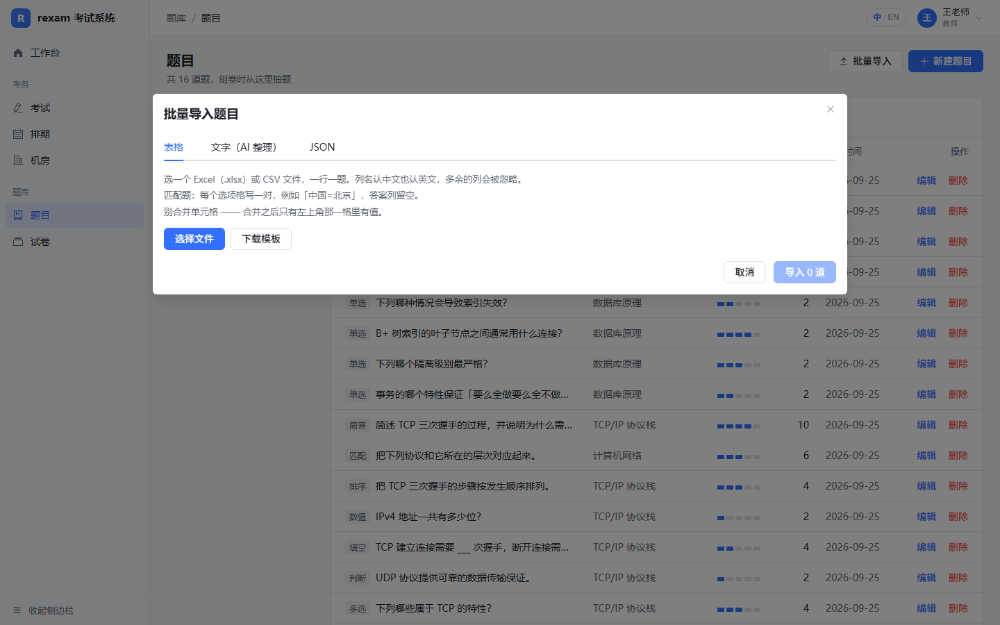

表格那条路在浏览器里解析，文件不上传服务器。GBK 编码的 CSV（WPS 导出的默认就是）、
表头前面的标题行、空着的列，都认得出来。哪一行为什么不能导，会直接写在那一行后面 ——
「答案里的 C 没有对应的选项」比「导入失败」有用得多。

列名和模板对不上也不用回去改表头，点「交给 AI 整理」，整张表丢给模型。

> **AI 认出来的题一律先进预览表，人点「导入」才写数据库。** 模型会编答案，这一步不能省。
> 服务端没配 AI 时这一项会直接说「没配」，不会转圈。

---

## 考试与监考

建考试时定三件事：**考试窗口**（几点到几点谁都进不来）、**答题时长**（从考生自己点开始算）、
以及一串防作弊开关。考生的截止时间取「他的开始时刻 + 时长」和「考试结束时间」里较早的那个。

考试分草稿、已发布、已关闭三种状态：草稿不会出现在考生那边，发布之后考生才会在
「我的考试」里看到它，关闭会把还没交的卷子一并强制交上来。

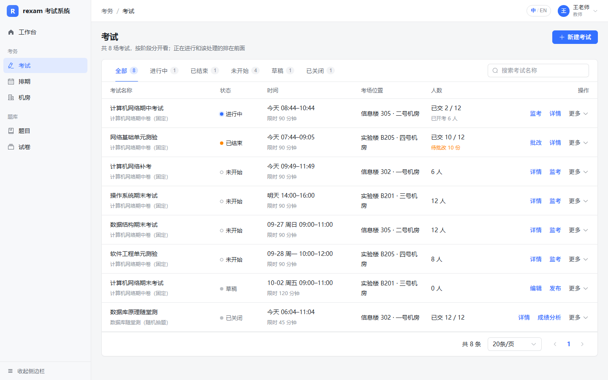

每场考试有一个 **6 位考场码**，考场电脑靠它加座位号定位自己。考场码可以随时重置，
重置时能一并把全场机位解绑——考场码万一外泄，只换码是不够的。

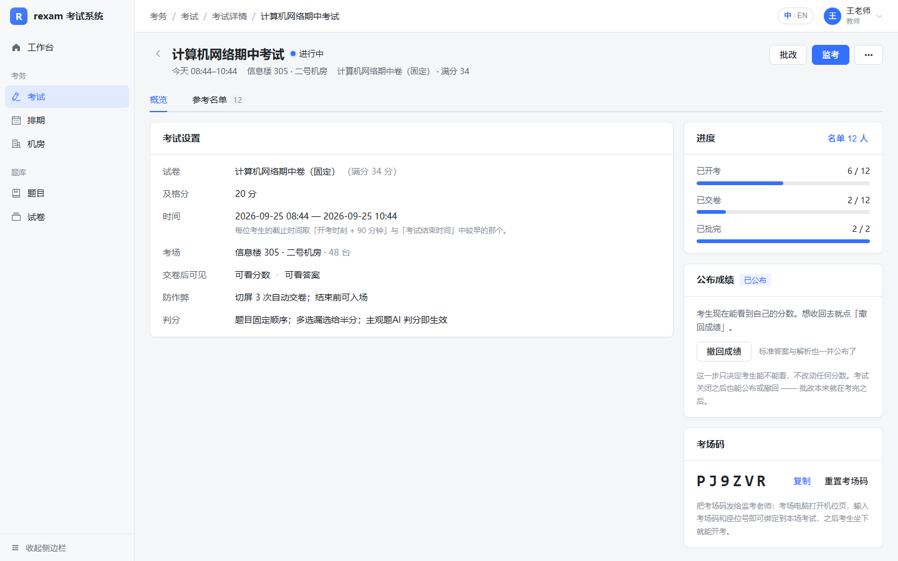

**监考页**实时显示每个座位：没安排考生、没绑电脑、待开考、答题中、掉线、已交卷，
外加每人的切屏次数。可以按座位图看，也可以按名单看。老师能对单个考生**强制交卷**或**补时**，
也能一键关闭整场考试。

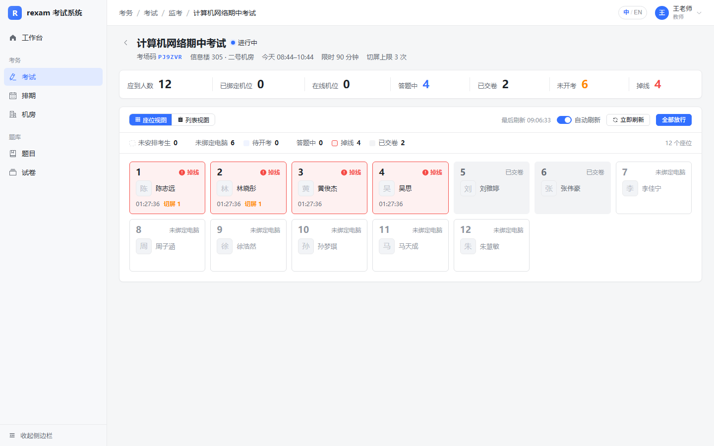

### 排期：连着几天考，座位要不要沿用

一个机房连着几天考试，同一批学生反复进来。每一场开始前都重新抽一遍机器吗？
**系统不替你决定** —— 把几场考试串成一个排期，每一场单独选：

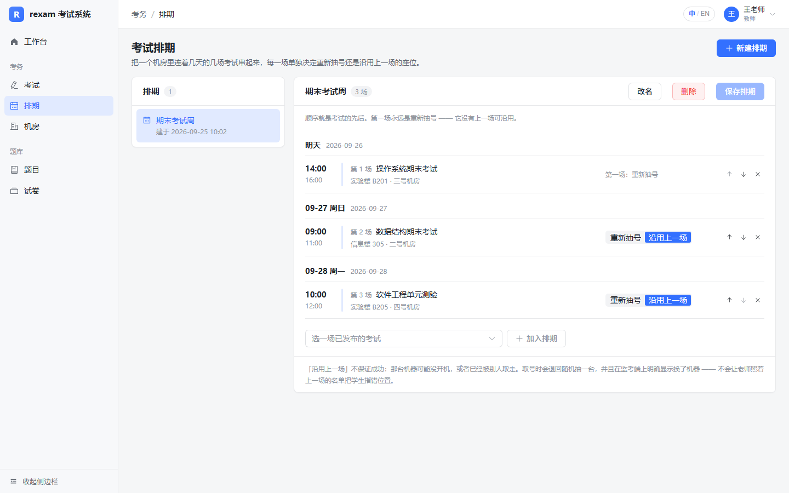

| 选项 | 什么时候用 |
|---|---|
| **重新抽号** | 座位固定等于给了作弊余地，要求场场重抽的学校用这个 |
| **沿用上一场** | 学生知道自己那台机器在哪，进场快、少出错 |

第一场永远是重新抽号 —— 它没有上一场可沿用。这一条在服务端也拍死，
不是只在界面上灰掉。

> **沿用不保证成功。** 那台机器可能没开机，或者已经被别人取走。
> 取号时会退回随机抽一台，并且在监考端上**明确显示换了机器** ——
> 不会让老师照着上一场的名单把学生指错位置。

### 取号：照着照片核对本人

考前核对身份这一步，光有名单不够 —— 老师手里只有一张纸，对面站着一个人。
所以座位卡上带**考生照片**：点开座位就是照片、姓名、账号三样摆在一起，
对得上才放行。

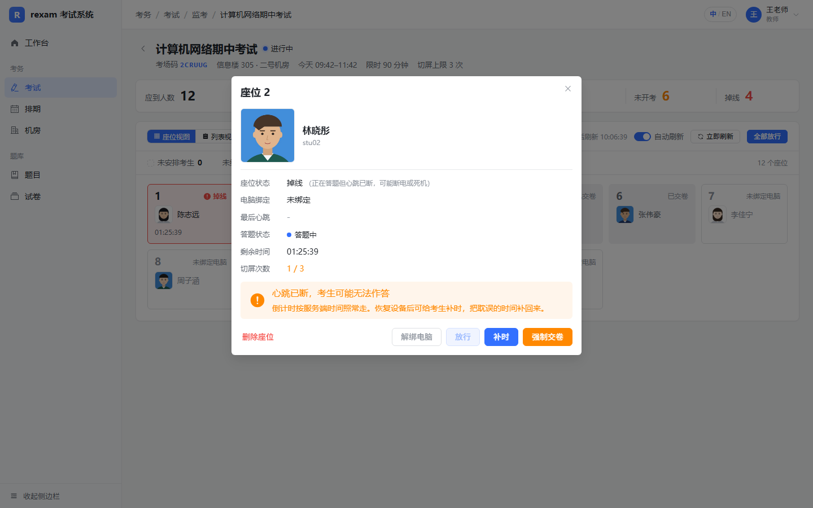

照片在「用户管理」里整批导入：选一个 zip（或者直接选一堆图），
按文件名对人 —— 先对账号、再对姓名。**同名的不猜**，标出来让你改文件名，
因为贴错照片比没有照片更糟。图片在浏览器里压到 256×256 再上传，
手机里导出来的 4MB 原图不会砸进数据库。

> 存的是**证件照**，不是身份证扫描件。后者是敏感个人信息，存它要另一套东西
> （加密、留痕、保留期限），这个系统不碰。照片只有教师和管理员取得到，能删，删了不留副本。

**答案不会丢。** 考生每答一题就写回服务端，先落 Redis 再由后台任务批量刷进 PostgreSQL。
断电、蓝屏、断网重连，回来直接续答，一道不少。倒计时按**服务端时间**算，
考场机器时钟不准、或者被人改过，都不影响。

---

## 判分与成绩

前七种题型交卷即判完。简答题、以及按规则没拿满分的填空题，走主观题流程，三选一：

- **教师批改**——老师逐题给分，可以写评语。
- **AI 判分**——直接采用 AI 给的分。
- **AI 初判 + 教师复核**——AI 先给一个分和一段按评分点展开的说明，老师看一眼，
  同意就一键采纳，不同意直接改。**AI 原来给的分会一直留档**，改完还能对照。

AI 走任意 **OpenAI 兼容接口**，配置模板里预置了 DeepSeek 和通义千问的地址。
判分请求失败会重试，重试用尽就把这道题转人工，不会悄悄记 0 分。
简答题的「解析」栏请写评分要点（比如「说清三个步骤各 2 分，提到历史重复连接 2 分」），
AI 会读它，写得越具体给分越准；人工批改时也一眼能对着给。


考完有**成绩分析**：平均分、最高最低、及格率、分数段分布，以及**每题正确率**
——正确率低的排在前面，讲评时先讲哪道题一目了然。成绩可以导出。

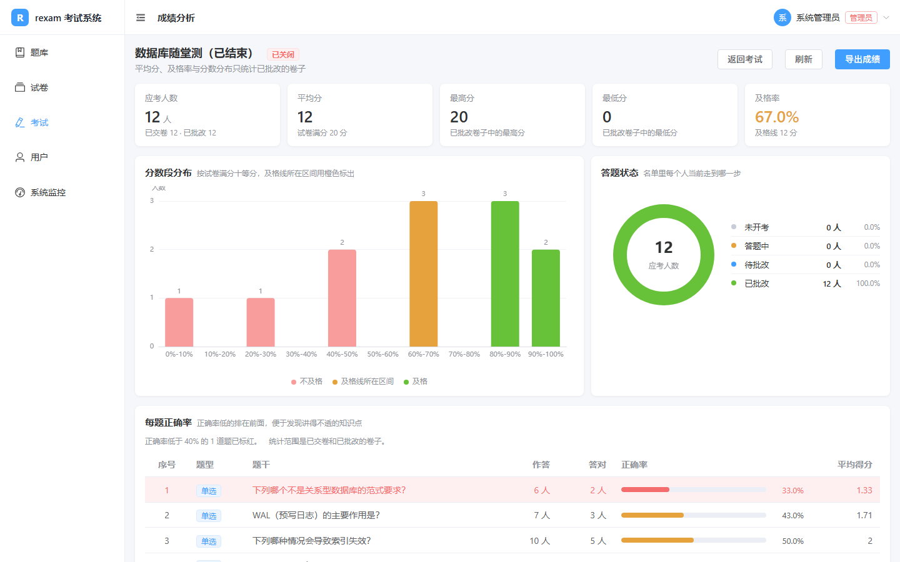

考生这边能不能看分、能不能看答案，由每场考试单独设置，客户端不自作主张。

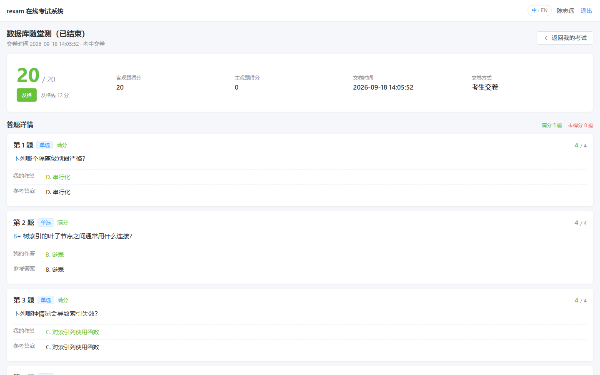

---

## 系统监控

管理员能看到这台 API 节点的实时状态：CPU / 内存 / 磁盘 / 交换、PostgreSQL 与 Redis 的
响应时间和连接池、四个后台任务的心跳与累计处理量、当前负荷、以及 AI 判卷的队列和成败计数。

**判断标准写在服务端**，页面只负责显示结论——「磁盘已用 97%，写满后数据库会直接停止写入」
这种话由服务端给，换个客户端来读也是同一套结论。

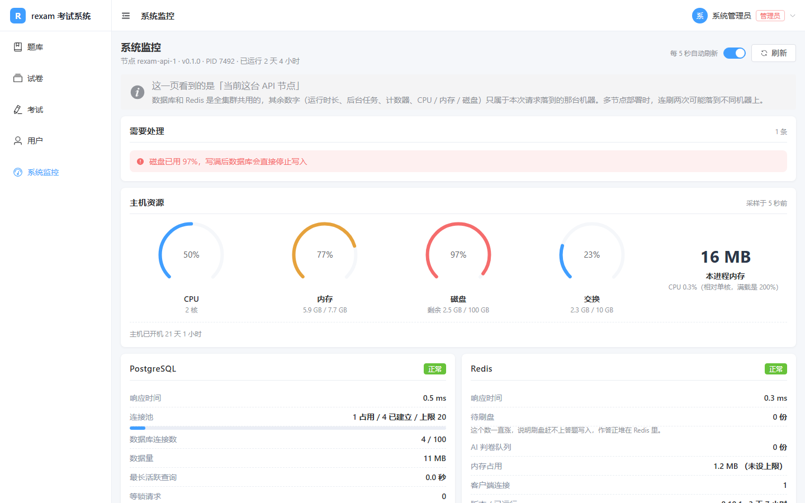

后台任务这一块值得单说：**心跳停了和「没活干」是两回事**。
刷盘任务每 3 秒一轮，即使没有作答要写也会记一次心跳；心跳超过间隔的四倍还没动静，
它就会被标成卡住。这样才分得清「闲着」和「死了」。

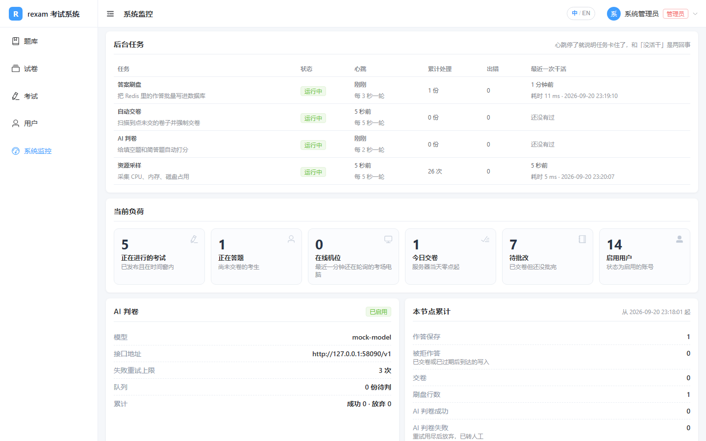

> 这一页的数字只描述**当前这台 API 节点**。数据库和 Redis 是全集群共用的，
> 其余数字（运行时长、后台任务、计数器、CPU / 内存 / 磁盘）只属于本次请求落到的那台机器。

---

## 考场客户端

Windows x64，单个 exe，不装任何运行时，不依赖浏览器。界面支持中英文，
`lang = "en"` 时整个客户端是英文的（[英文版说明](README.en.md#the-exam-room-client)里是英文界面的截图）。

**考生不输账号密码。** 座位提前排好，机器开机自己绑到座位号上并开始轮询；
监考老师一点开考，服务端把这个座位对应考生的凭证发下来，客户端自动进答题页。

| | |
|---|---|
| 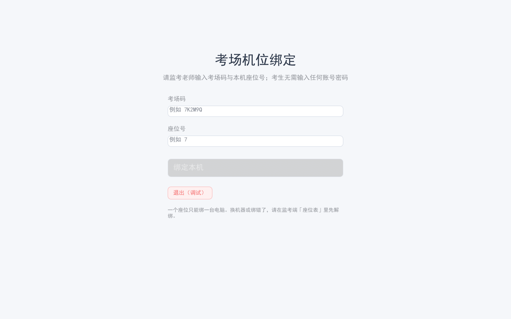 | 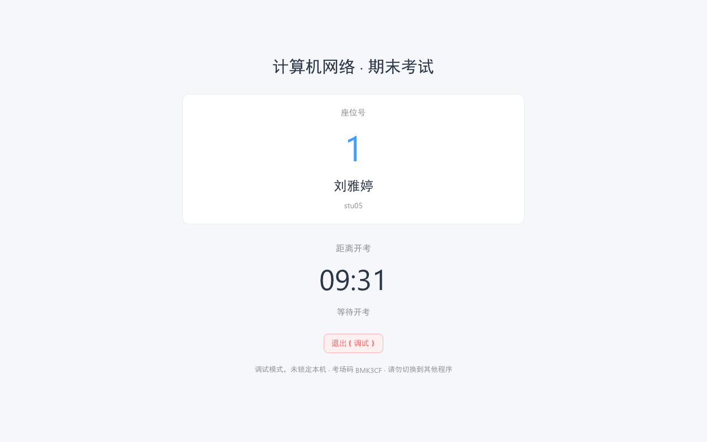 |

答题期间屏幕锁定：独占全屏、窗口置顶、没有标题栏，低级键盘钩子吞掉
`Win`、`Alt+Tab`、`Alt+Esc`、`Ctrl+Esc`、`Ctrl+Shift+Esc`、`Alt+F4`、`Alt+空格` 和 `PrintScreen`。
窗口一丢焦点，看门狗立刻上报并把它抢回前台。更严的一档还会禁用任务管理器、禁用 U 盘存储、
并结束黑名单里的程序。

八种题型在客户端都是原生绘制的，不是网页套壳：连线题真的画线，排序题按住就能拖、
松手前下面的行就跟着让位，判断题的对勾和叉是画出来的矢量图形
（中文字体里根本没有 ✓ ✗ 这两个字形，用字符只会得到两个豆腐块）。

| | |
|---|---|
| 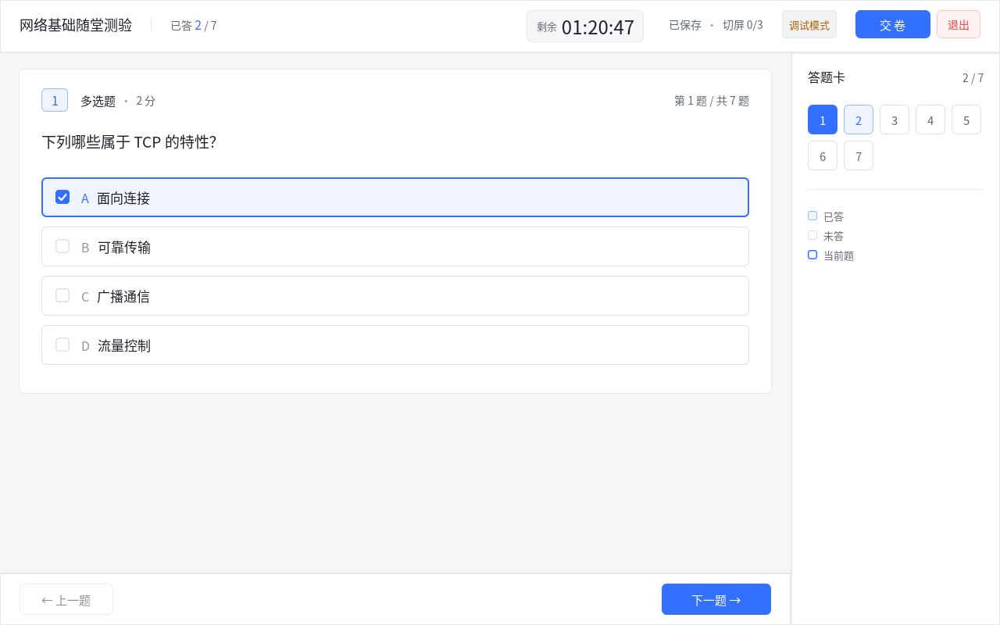 | 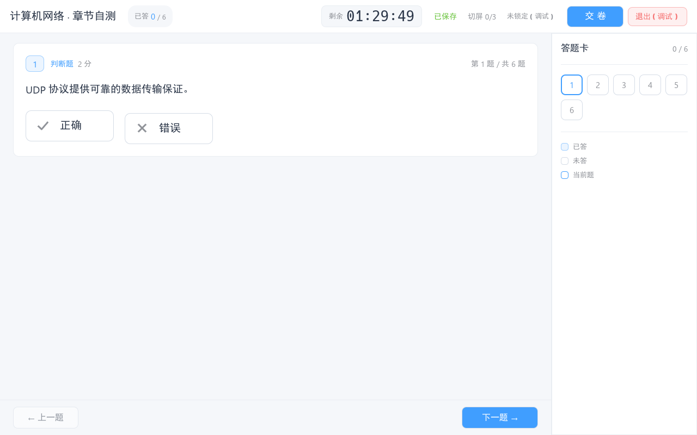 |
| 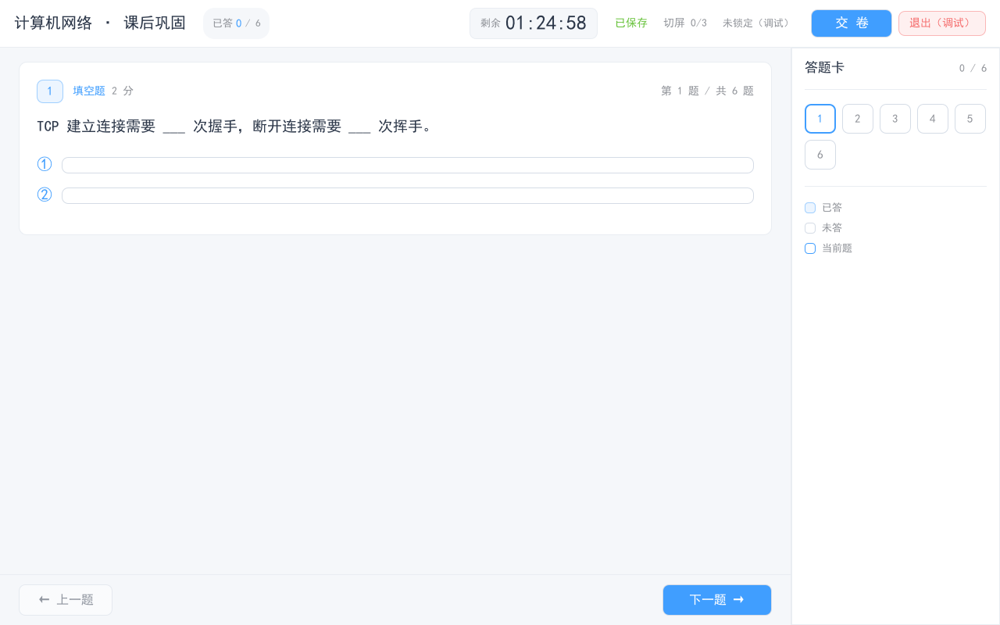 | 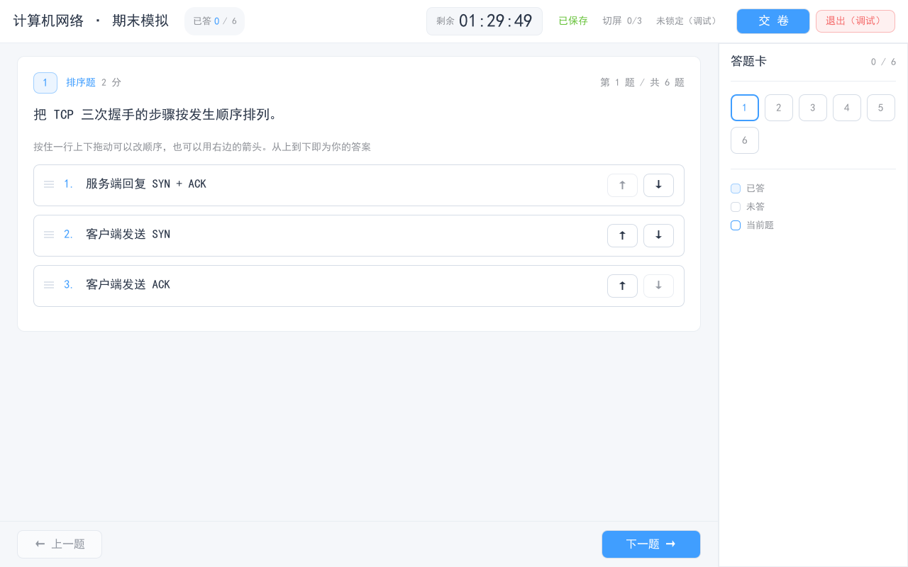 |
| 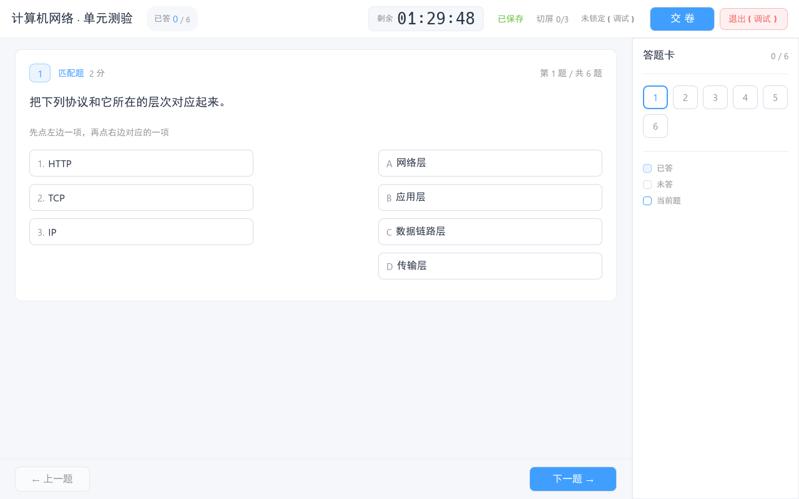 | 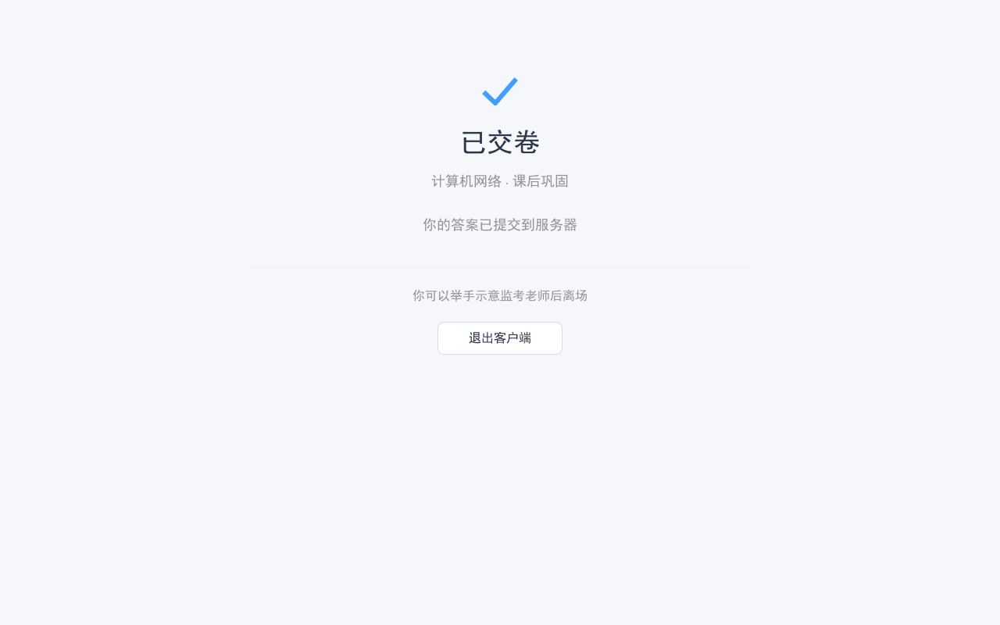 |

答题卡上**填色表示已答、空心表示未答**，不用绿色——考试还没判分，
绿色会被考生读成「我这题做对了」。

## 监考端

一个装在**老师自己那台电脑**上的小程序（`proctor/rexam-proctor.exe`）。
考试当天用它取号、看考场；考前维护用它布机。详见
[监考端说明](proctor/README.md)。

登录、选考试、进考场之后默认落在**看板**：一台电脑一块砖，像监控墙那样铺满，
顶上一行是这场考试的时间安排（几点开、几点截止、还有多久）。掉线的砖是红的，
点任意一块能核对照片、补时、强制交卷。

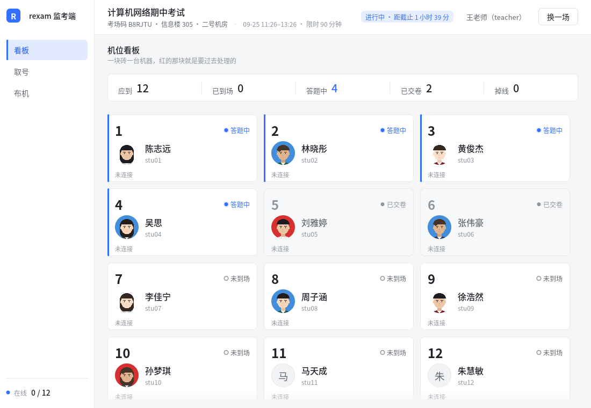

**取号**是另一个页签：考生报名字 → 搜一下 → **对着照片确认是本人** → 取号。
建考试时选「现场随机取号」的考场，这一下会从空闲机器里随机抽一台，把号码大字报出来；
选「提前全部分配」的，这一下只是确认到场。抽号在服务端做且整场加锁 ——
两个老师同时取号不会把两个学生指到同一台机器上。

**布机**页签是维护人员那一套：开起来之后它在局域网里每两秒广播一次「我在这」，
考场机开机听见就连过来领座位。屏幕上的「连上 N 台 / 应到 M 台」就是布机进度，
另外还有信标发包数、主机名、IP —— 排查网络问题要看这些。

它**不判分、不算时间、不自己决定谁坐哪** —— 排座和抽号都是调服务端的接口。
判分和时间规则只有一份，在服务端，监考端重写一份就等于埋下「两边算得不一样」的雷。

### 它不做的事

- **不需要它也能开考。** 装机时给了 `--server`、`--room-code`、`--seat-no` 的机器
  照旧直接绑定，监考端只是把这三样从装机环节挪到了开考环节。
- **考场机仍然直连服务器答题。** 监考端只管布机，不转发答题流量，
  所以它中途关掉不影响正在考试的人。
- **它不能在没有外网的考场里收卷。** 那需要考场包离线下载、监考端本地签发考生凭据、
  题面进包、答案落盘缓冲 —— 每一件都得单独设计，现在还没做。

### 局域网上要通的东西

| | 端口 | 谁监听 |
|---|---|---|
| 发现 | UDP 45301 | 双方（广播 + 组播 239.255.73.77） |
| 布机 | TCP 45300 | 监考端 |

考场机找得到监考端却连不上，**十有八九是监考端那台电脑的防火墙挡了入站连接** ——
出站的广播照发，所以症状很像「发现不了」。考场机屏幕上会把这句话直接写出来。

### 关于信任

局域网发现用的是明文 UDP，**谁都能广播一条假信标**。所以：

- 信标只是一条线索，报文里**不带 IP**，地址一律取 UDP 源地址 ——
  否则伪造一条信标就能把整场考试指向任意主机；
- 装机时带了 `--server` 的机器只认那个地址，假监考端骗不走它；
- 老师屏幕上「连上 N 台 / 应到 M 台」对不上，就是有机器被别处接走了。

这一步**没有做 TLS 和公钥固定**，威胁模型只到「防手滑、防配置错」，
不到「防同网段的主动攻击者」。写清楚，免得有人高估它。

### 考完了怎么放人

**监考端说了算，不在考生那台机器上。**

考生交完卷，屏幕继续锁着 —— 先交卷的人不该在别人还在考的时候回到桌面。老师在监考页的
座位表上点「放行」，那台机器下一轮轮询（默认 3 秒）就解锁；散场时直接**关闭整场考试**，
服务端会把全场机位一并放行，不用挨台点。

所以装机时不需要给每台机器写监考口令 —— 口令写在考生够得着的机器上本来也谈不上多严。
`exit_password` 仍然保留，但只是**断网时的兜底**：服务端连不上、又必须把机器从锁定里
弄出来时才用得上。不设的话结束页干脆不显示口令框。

> 要在考试**中途**放一台机器走（考生身体不适之类），先强制交卷再放行 ——
> 收卷和放人是两件事，不该一个动作做完。

### 关于 Ctrl+Alt+Del

**这组键本身拦不住。** 它是 Windows 的安全注意序列，由 Winlogon 直接处理，低级键盘钩子
按设计就摸不到它 —— 这是系统用来保证「这一屏一定是系统弹的」的机制，不是可以绕过的疏漏。

所以硬锁换了个打法：**拦不住那一屏，就让那一屏没有东西可点。** 任务管理器、锁定计算机、
更改密码、注销、切换用户会被逐项关掉，考生按下去只看到一屏全是灰的选项，按 Esc 退回来
——而这次失焦已经被看门狗记下并上报了。这几项里有四项写在 `HKCU` 下，
**不需要管理员权限**，考生自己的普通账号就能生效。

真要连那一屏都不出来，只有 Windows 的**键盘筛选器**（Keyboard Filter，企业版 / IoT 企业版
的可选功能）做得到。装了这个功能的机器可以打开 `block_sas`。默认不开，因为它是**机器级**
开关、靠客户端退出时还原：客户端被强杀（断电、从别的账号结束进程）就还不回去，
那台机器会一直按不出 `Ctrl+Alt+Del`，而下一个用机器的人完全不知道发生了什么。
开之前请先在一台机器上确认还原是好使的。

### 它还是做不到的事

**硬件手段管不了**——手机、纸条、第二台设备。客户端只负责让软件层面的作弊留下记录
并且变麻烦，剩下的靠监考老师走动。写清楚比藏着强，免得有人高估它。

所有违规都**只上报**。切屏几次算超限、要不要自动交卷，一律由服务端判定，客户端不自己算
——跑在考生机器上的判断本来就不可信。

改过的注册表项在退出时按**改之前读到的原值**还原，包括「本来就没有这个值」的情况；
进程被强杀也有兜底，不会把机器带着「任务管理器已禁用」还给机房。

### 考场机器怎么装

**一条命令，不带任何参数：**

```bat
rexam-client.exe --install
```

它自己写 `config.toml`、自己登记开机自启（`HKCU` 下的 Run 项，不需要管理员），
然后退出。装机脚本按机器循环一遍即可，`--uninstall` 撤销。

**服务器地址、考场码、座位号都不用填。** 老师在自己那台电脑上打开**监考端**、
登录、选一场考试，考场机开机就会在局域网上找到它，把这三样全部领回来。
详见下面的 [监考端](#监考端)。

**口令也不用给。** 散场是监考老师点「放行」，解锁从服务端下发到机器，
这台机器上不用输入任何东西。

> **高利害考试建议钉死服务器**：
>
> ```bat
> rexam-client.exe --install --server=https://exam.example.com
> ```
>
> 加了这一项，机器只认这个地址，监考端下发别的一律忽略。
> 这个值**全校每台机器都一样**，不是「每台不同」的那种麻烦，装机脚本里写死一次即可。
> 为什么建议加：局域网发现用的是明文 UDP，谁都能广播一条假信标 ——
> 钉死之后，伪造的监考端最多让机器连不上，骗不走它。

**座位号可以不给**：不写 `--seat-no` 的话，机器开机会停在绑定页，由监考老师现场敲一次
考场码和座位号；有座位表的机房照旧按机器下发 `--seat-no=7`。

想手写配置也行，`config.toml` 放在 exe 同目录：

```toml
server = "https://exam.example.com"
lock = "soft"              # soft 不需要管理员权限；hard 另外还会禁任务管理器和 U 盘
lang = "zh"                # 界面语言：zh 中文（默认）/ en English
room_code = "E86HDZ"       # 本场考试的考场码，在考试详情页看
seat_no = 7                # 每台机器不同
exit_password = ""         # 断网兜底用的本地口令，一般不用设
```

批量装机时座位号可以用命令行给，一台一条：

```bat
rexam-client.exe --server=https://exam.example.com --room-code=E86HDZ --seat-no=7
```

`lang` 只换客户端自己的文案。题干、选项、考生姓名都是服务端下发的出题人内容，
一律按原样显示 —— 中文卷子配英文界面，题目还是中文的。

`config.toml.example` 里每一项都写了改它会影响什么。
把 `lock` 设成 `off` 时界面上会直接出现退出按钮——那是调试用的，正式考试绝不能用
（上面的客户端截图都是调试模式拍的，所以右上角有「退出（调试）」）。

老机器没有独立显卡、或者通过远程桌面使用时，把 `low_graphics` 打开。
它关掉抗锯齿羽化，而纯软件绘制时羽化正是每帧开销的大头。

> 没有客户端也能开考：浏览器打开 `/seat`，输考场码和座位号，同样能当机位用。
> 拦不住切屏，适合要求没那么严的场合。
>
> 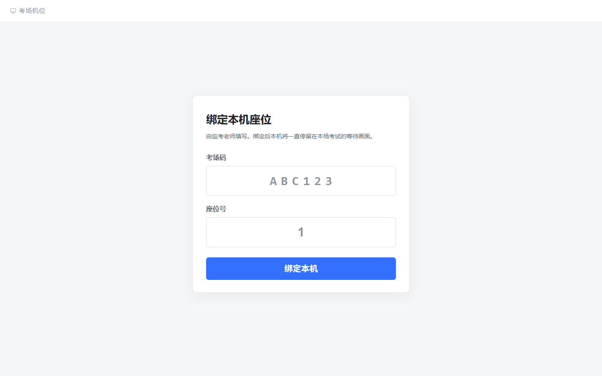

---

## 部署

需要 **PostgreSQL 16+** 和 **Redis 6.2+**（6.2 是下限，刷盘用到了 `LPOP key count`）。

```bat
copy server\.env.example server\.env
:: 改 .env：数据库地址、Redis 地址，以及下面强调的那两项
server\rexam.exe
```

首次启动自动建表；用户表为空时会创建初始管理员。监听地址由 `BIND_ADDR` 决定，
默认 `0.0.0.0:8080`。

**前端**是 `web/` 下的一堆静态文件。nginx 指过去，再把 `/api` 反代到服务端即可。
`deploy/nginx.conf` 就是这么配的，也带了单页应用需要的深层路由回落。

**关于平台**：这里的服务端是 **Windows x64** 版，因为构建机就是 Windows。
`deploy/` 里的 systemd 单元是给 Linux 版用的，一并放进来供参考。
本次发布**没有 Linux 版二进制**，需要的话得在 Linux 上（或用交叉工具链）从源码编译。

## 对外开放之前

这两项必须改掉：

- **`JWT_SECRET`**——模板里那串是占位符，不是密钥。
- **`ADMIN_PASSWORD`**——不设的话程序会退回**编译进去的默认值**，
  等于任何知道这个项目的人都能用管理员身份登进来。

另外两条建议：数据库和 Redis 不要对公网开放；服务端放在 nginx 后面走 HTTPS，
考场客户端和浏览器都用同一个域名。

密码用 argon2 存，接口鉴权用 JWT，角色权限在服务端逐个接口校验——
前端藏起来的菜单挡不住直接调接口，所以没靠它。

## 规模

同一套程序，几十人的随堂测验和两万人的统考都能跑，区别只是加机器。
API 节点无状态，答案先写 Redis 再由后台任务批量刷进 PostgreSQL，交卷是幂等的，
所以 nginx 后面挂多少个节点都行。

在一台四核开发机上实测（数据库同机）：**200 人同时交卷并完成判分耗时 368 毫秒，零丢失**。

## 常见问题

**考生考到一半断电了怎么办？**
重新开机进来接着答。已答的题都在，倒计时按服务端时间续，不会重置也不会多给。

**考场没有外网可以吗？**
可以。服务端、数据库、前端都放在内网机器上，考场客户端指向内网地址即可。
AI 判分需要外网；不用 AI 的话把它关掉就行，主观题转教师批改。

**能不能一场考试每个人题目都不一样？**
用随机卷。抽题规则按分类、题型、难度设定，同一个人不会抽到重复题。

**切屏计数会不会误伤？**
会。有些电脑弹个系统通知也会触发失焦。建议上限设 3 到 5，别设 1。
设成 0 表示不限制，只记录不自动交卷。

**AI 判错了怎么办？**
用「AI 初判 + 教师复核」这一档，老师改分即可，AI 原来给的分仍然留档可对照。

**教师能看到别人的题库吗？**
能看到题库和试卷（共享的），但用户管理和系统监控只有管理员进得去。

## 仓库里有什么

| 路径 | 是什么 |
|---|---|
| `server/rexam.exe` | 后端服务，Windows x64。整套 REST 接口都在这里。 |
| `server/.env.example` | 配置模板。复制成 `.env` 放在程序同目录。 |
| `client/rexam-client.exe` | 考场客户端，Windows x64。单个文件，不装任何运行时。 |
| `client/config.toml.example` | 客户端配置模板，每一项都注明改它会影响什么。 |
| `proctor/rexam-proctor.exe` | 监考端，Windows x64。装在老师自己的电脑上，考场机靠它零配置开考。 |
| `web/` | 编译好的前端，纯静态文件，交给 nginx 或任意 web 服务器托管。 |
| `deploy/` | nginx 站点配置和 systemd 单元。 |
| `docs/监考操作手册.md` | 写给老师看的全流程操作手册，不需要懂技术。 |
| `docs/screenshots/` | 上面这些截图。 |

技术栈：服务端 Rust（axum + tokio + sqlx + redis），前端 Vue 3 + Vite + Element Plus，
考场客户端 Rust + egui 原生绘制。

## 关于开源

**源码暂时不放出来。** 系统还在完善阶段，肯定还有没暴露出来的问题，
这时候把代码摊开，别人拿去跑真考试反而容易出事。等跑稳了再开源。

现在这个仓库放的是可以直接部署的编译产物：服务端、前端和考场客户端，
功能是完整的，不是试用版。用下来有问题欢迎提 issue。

## 许可

未指定。转发前请先联系仓库所有者。
