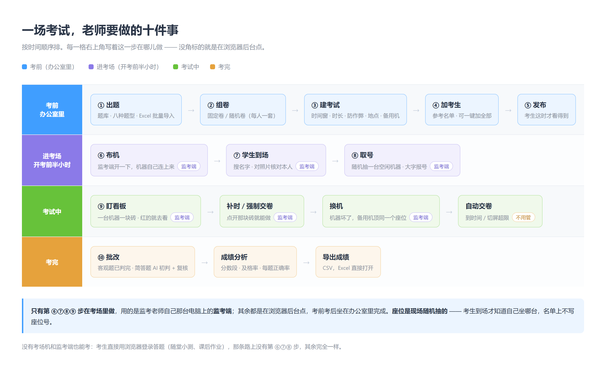
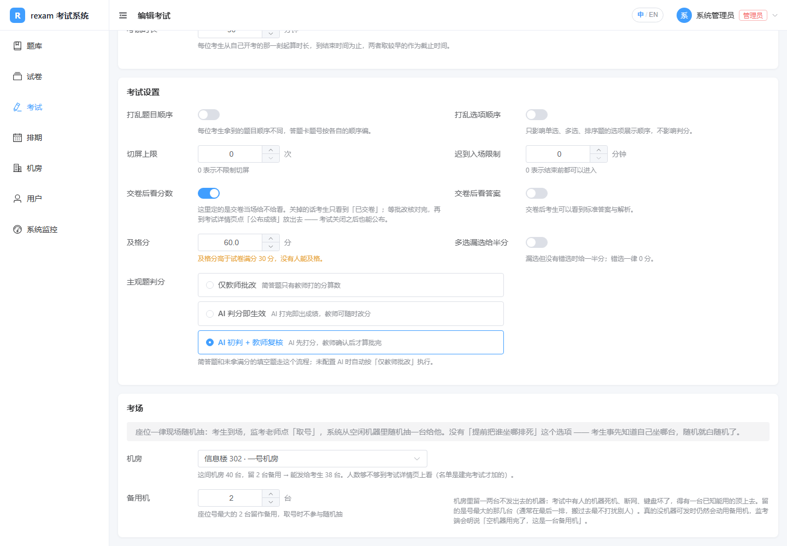
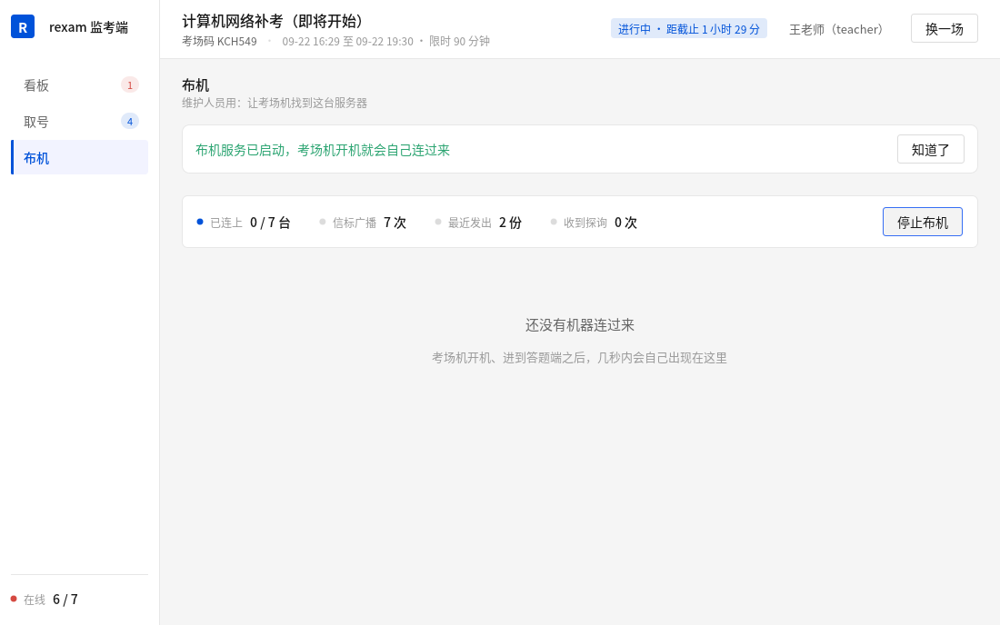
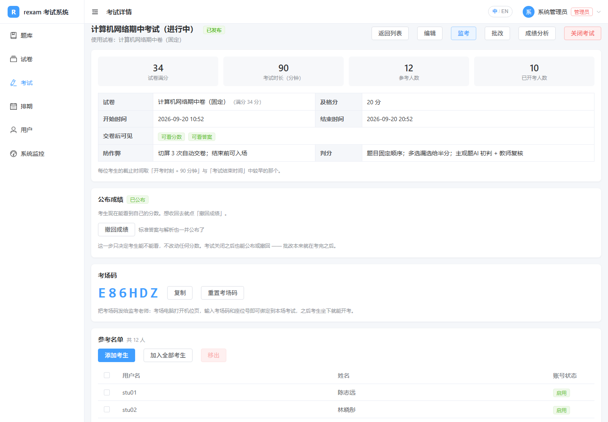

# 监考与教务操作手册

写给用这套系统组织考试的老师。不需要懂技术。



**只有第 ⑥⑦⑧⑨ 步在考场里做**，用的是监考老师自己那台电脑上的**监考端**；
其余都是在浏览器后台点，考前考后坐在办公室里完成。

---

## 一场考试从头到尾

### 一、准备题目

**题库 → 新建题目**。八种题型：

| 题型 | 什么时候用 | 注意 |
|---|---|---|
| 单选 | 只有一个正确答案 | |
| 多选 | 多个正确答案 | 考试设置里可以选"漏选给一半分" |
| 判断 | 对错题 | |
| 填空 | 一句话挖几个空 | **每个空可以填多个同义答案**，考生答中任意一个都算对 |
| 数值 | 答案是数字 | 可以设允许误差，比如 3.14 允许 ±0.01 |
| 排序 | 把步骤排顺序 | 考生看到的顺序是打乱的 |
| 匹配 | 左右两栏连线 | 右栏可以比左栏多，多出来的是干扰项 |
| 简答 | 需要人看的题 | 参考答案和"解析"都会给 AI 判分时参考 |


**简答题的解析栏请写评分要点**，比如"提到三次握手 3 分，说明目的 1 分"。
AI 判分时会读它，写得越具体给分越准。人工批改时也一眼能对着给分。

题目多的时候用**批量导入**，三种进料口：**表格**（Excel / CSV，一行一题，界面里能下模板）、
**文字（AI 整理）**（粘一段题目文字让 AI 拆成题目）、**JSON**。
导入前有一屏预览：哪一道能导、哪一道有问题、问题在哪儿都标出来，确认了才真的入库。


> **走 AI 整理那条路的话，导入之前一定要自己把答案过一遍。** AI 会编答案 ——
> 它把题干拆对了不代表答案也对。界面上也写着这句话，别跳过。

### 二、组卷

**试卷 → 新建试卷**，两种方式：

- **固定卷**：从题库挑题，每题设分值，所有考生拿到同一份。
- **随机卷**：设几条规则，比如"从'计算机网络'分类抽 20 道单选，每题 2 分"，
  **每个考生抽到的题不一样**，适合防抄袭。


随机卷建好后一定要点**试抽一次**，确认题库够用。题库不够的话这里会直接告诉你缺多少道，
比考试当天考生进不去要好得多。

### 三、建考试

**考试 → 新建考试**。时间这块容易搞混，解释一下：

- **开始时间 / 结束时间**：考试窗口。这个窗口之外谁也进不来。
- **考试时长**：每个考生自己的答题时间，从他点开始的那一刻算。

**考生的截止时间 = 他的开始时刻 + 时长，和考试结束时间，取较早的那个。**
比如考试窗口 9:00 到 11:00、时长 90 分钟：9:00 进来的考生做到 10:30，
9:40 才进来的考生做到 11:00（只有 80 分钟）。

几个常用设置：

- **打乱题目顺序 / 打乱选项**：防邻座抄袭。排序题和匹配题不管设不设都会打乱，否则原顺序就是答案。
- **迟到入场限制**：开考多少分钟后不许再进。**已经在答题的考生不受影响**，
  断电重启后仍然能回来，这点不用担心。
- **切屏次数上限**：考生切走页面会被记录，超过次数自动交卷。设 0 表示不限制。
  建议设 3 到 5，太严容易误伤（有些电脑弹通知也会触发）。
- **交卷后可见分数 / 可见答案**：这里定的是**交卷当场**给不给看。
  正式考试通常两个都关 —— 主观题还没批完就放出去，考生看到的是个半截分数。
  **关掉不等于永远不出分**：等你把卷子批完、分数核过，到考试详情页点「公布成绩」
  就能放出去，考试关闭之后也能公布（见第十步）。
- **主观题判分方式**：见下面第六步。
- **备用机台数**（「考场」那一段）：留几台不发出去的机器，顶替考试中坏掉的那台。
  留的是**座位号最大的那几台**（通常在最后一排，搬过去最不打扰别人），
  取号时不参与随机抽。建议按考场规模留 1 到 2 台。
  真的没机器可发时仍然会动用备用机，监考端上会明说「空机器用完了，这是一台备用机」。

座位**一律现场随机抽**：考生到场，监考老师点「取号」，系统从空闲机器里随机抽一台。
没有「提前把谁坐哪排死」这个选项 —— 考生事先知道自己坐哪台，随机就白随机了。



建完先是**草稿**状态，考生看不到。加完人再**发布**。

### 四、加考生

**考试详情 → 参考名单**。可以逐个选，也可以一键"加入全部考生"。


考生账号在**用户**页面管理（只有管理员能进）。批量导入支持粘贴
`用户名,姓名` 每行一条，统一设一个默认密码。

**考生照片**也在那里整批导入（用户管理 → 批量导入照片）：选一个 zip 或者一堆图，
按文件名对人，先对账号再对姓名，同名的不猜。取号时监考老师就是照着这张照片核对本人。
存的是证件照，不是身份证扫描件 —— 后者是敏感个人信息，这个系统不碰。

### 五、布机：把考场电脑摆上座位号

机位模式的好处：**考生不用记账号密码**，坐到分给他的机器前，到点自动进入答题页。

这里要分清两件事：

| | 什么时候定 | 谁定 |
|---|---|---|
| **机器 ↔ 座位号** | 开考前布机 | 老师（或者机器自己领） |
| **考生 ↔ 座位号** | 考生到场那一刻 | 系统随机抽 |

**没有"排座位表"这一步。** 名单上不写座位号，也不用打印座位表贴门口 ——
考生到了讲台报名字，监考老师点一下「取号」，系统才从空闲机器里随机抽一台给他。
提前排死等于考生事先知道自己坐哪台，随机就白随机了。

把机器摆上座位号有三条路，选一条：

| 方式 | 怎么做 | 适合 |
|---|---|---|
| **监考端布机** | 监考端点「开始布机」，考场机开机自己连过来领号 | 装了考试客户端的机房，**最省事** |
| **网页机位** | 每台电脑打开 `系统地址/seat`，输一次考场码和座位号 | 没装客户端，用浏览器考 |
| **装机时写死** | 客户端的 `config.toml` 里写 `seat_no` | 机器位置固定、重装也不变的机房 |


**考场码**在考试详情页上，6 位，只给监考老师，不要发给考生。

**网页机位的两个前提，绑之前先确认**：

- 考试必须已经**发布**。草稿状态绑不了。
- 必须在**开考前 24 小时以内**。再早系统会拒绝。
  这是为了防止考场码泄露后有人提前把全场座位占满 —— 一个座位只能绑一台电脑，
  被占了真实机器就绑不上了。需要更早布机的话让运维调 `SEAT_BIND_LEAD_HOURS`。

绑好之后屏幕上显示大大的座位号，等着考生过来。

一个座位只能绑一台电脑。绑错了或者要换机器：在那台机器的机位页上点「解除本机绑定」，
或者在监考端的布机页点「换机」，然后拿新机器重新绑，卷子和已答内容都不受影响。

**考场码泄露了怎么办**：到考试详情页点"重置考场码"，勾上"同时解绑所有机位"。
只换码是不够的 —— 拿着旧码已经绑上的电脑还在轮询，到点照样能领到考生凭证。
勾上之后全场机位都会打回未绑定状态，需要逐台重新绑，代价大但能真正止血。

### 五之二、用考试客户端（防作弊更强）

机位页是网页，考生按 Alt+Tab 还是能切到别的窗口去 —— 系统会记一笔切屏、超次数自动交卷，
但挡不住他真的看到别的东西。要在机房里把机器**锁在考试里**，用考试客户端。

客户端是一个 exe，考生看到的流程和机位页一模一样（坐下、到点自动进答题页、不输账号密码），
区别只在于它会把机器锁住。

**装机（每台一次）**

1. 把 `rexam-client.exe` 和 `config.toml` 放进同一个文件夹，加进「启动」项。
2. `config.toml` 里填四样东西：

   ```toml
   server = "https://你的考试系统地址"
   lock = "soft"            # soft 不需要管理员；hard 还能禁任务管理器和 U 盘
   room_code = "E86HDZ"     # 本场考试的考场码
   seat_no = 7              # 这台机器的座位号，每台不同
   exit_password = "改成你自己的"   # 监考老师解锁用，一定要设
   ```

3. 装完起一次确认能连上：屏幕上应该显示大大的**座位号**和距开考的倒计时。
   显示不出来说明 `server` 填错了或者考试还没发布。


考生取过号之后，这台机器上还会显示他的姓名和账号，考生对着找座位。
（上图是 `lock = "off"` 的调试模式，所以底下有「退出（调试）」按钮；
正式考试用 `soft` 或 `hard`，那个按钮不会出现。）

**考试当天**

考生坐下什么都不用做。**没有「开考」按钮** —— 到了考试窗口的开始时间，
服务端自己放行，各台机器自动进答题页并锁屏。你要做的是在那之前把号取完。

**锁住之后拦得住什么**

- `Win` 键、`Alt+Tab`、`Alt+F4`、`Ctrl+Esc`、`Ctrl+Shift+Esc`（任务管理器）、`PrintScreen` 全部无效
- 窗口一旦失去焦点，立刻记一次切屏并自动抢回前台，次数照样计入自动交卷
- 接了第二个显示器会提示并上报
- 选 `hard` 还会关掉任务管理器、禁用 U 盘存储、自动结束 QQ / 微信 / 向日葵 / ToDesk 这类程序

**拦不住什么**（心里要有数）

- `Ctrl+Alt+Del` 拦不住，这是 Windows 的设计，任何客户端都做不到。
  考生按了会看到系统菜单，但客户端会在他回来之前就把失焦记下来，你在监考页看得到。
- 手机、纸条、旁边的人，客户端一概管不了，还是得靠你走动。

**考完怎么退出**

设了 `exit_password` 的话，考生交完卷屏幕仍然锁着，显示「请留在座位上，等待监考老师解锁」。
你走过去输一次口令就能退出。这样先交卷的考生不会在别人还在考的时候回到桌面。

没设口令则交完卷就解锁，考生可以自己关掉 —— 只适合全场同时结束的场合。

**怎么退出客户端**

按 `Ctrl+Shift+Q`，输入你在 `config.toml` 里设的 `exit_password`，即可退出。
考试中途要处理某台机器（考生身体不适、机器故障）也走这条路。

没设 `exit_password` 的话，按 `Ctrl+Shift+Q` 谁都能退出 —— 所以一定要设。
测试阶段可以把 `lock` 改成 `off`，界面右上角会直接出现「退出（调试）」按钮。

**换考场**：删掉客户端目录下的 `state.json`，改 `config.toml` 里的考场码，重新起一次即可。

### 六、判分方式怎么选

客观题（前七种）系统自动判，不用管。简答题有三种处理方式：

| 方式 | 适合 | 说明 |
|---|---|---|
| **仅教师批改** | 正式考试、有争议风险的考试 | 只认老师给的分 |
| **AI 判分即生效** | 平时练习、随堂测验 | AI 判完立刻出成绩，老师随时可以改 |
| **AI 初判 + 教师复核** | 量大但要把关 | AI 先打分，老师逐题确认或一键确认后才算批完 |

不管选哪种，**老师的分永远盖过 AI 的分**，AI 原来给的分会一直保留在旁边供对照。
系统没配 AI 的话，三种都按"仅教师批改"处理。

填空题稍微特殊：系统先按字面比对判一次，如果没拿满分，在 AI 模式下会再交给 AI
看一眼是不是意思对了只是写法不同（比如"三"和"3"）。

### 七、考试当天

考试当天你面前会开着**两样东西**，各管各的：

| | 在哪儿 | 干什么 |
|---|---|---|
| **监考端**（`rexam-proctor.exe`） | 你自己那台电脑 | 布机、给到场的考生取号、盯机位看板 |
| **网页监考页**（考试详情 → 监考） | 浏览器 | 看答题进度、剩余时间、切屏次数、单人补时 / 强制交卷 |

#### 取号：考生一个一个过来

考生走到讲台报名字，在监考端的**取号**页搜一下，**对着照片确认是本人**，点「取号」。
系统从空闲机器里随机抽一台，把号码大字报出来，你念给他听。


没输字的时候这一页直接列**还没取号的人**，照着队首那个点就行。
号码旁边会写清楚"为什么是这一台"（沿用上一场 / 动用了备用机 / 他本来就取过号）——
悄悄换一台不吭声，容易把考生指到错误的位置上。

#### 看板：抬头一眼扫全场

**一台电脑一块砖**，像监控墙那样铺满，按座位号排（位置固定才有肌肉记忆）。
左边那道色条是状态：红的就是要过去处理的。


「已交卷」**不给绿色** —— 绿容易被读成"答得对"，而交没交卷和答得怎么样是两回事。

点任意一块砖弹出详情：机位号、主机名、这台机器上的考生（照片、账号、几点取的号）；
考生正在答题时，下面还有「补 10 分钟」和「强制交卷」。


#### 网页监考页：看答题进度

顶上一排数字是全场概况：应到人数、已绑定机位、在线、答题中、已交卷、未开考、掉线。
**座位视图**把每个座位画成一张卡片，图例就在上方：

| 图例 | 含义 | 要做什么 |
|---|---|---|
| 未安排考生 | 这个座位还没人取号 | 开考前正常；开考后还空着就看看人齐没齐 |
| 未绑定电脑 | 考场电脑还没连上来 | 去那个位置看一眼机器开没开 |
| 待开考 | 电脑已就位，考生还没开始 | 正常 |
| 答题中 | 正常作答 | 不用管 |
| **掉线** | **正在答题但心跳断了** | **去看一眼，多半是断电或网线松了** |
| 已交卷 | 交完了 | 正常 |

点任意一张座位卡片可以：解绑电脑、放行、补时、强制交卷、删除座位。


**注意「解绑电脑」不等于把考生踢下线。** 解绑只是让这台机器不再认这个座位，
考生浏览器里已经拿到的登录凭证仍然有效，他可以继续答题到交卷。
真要让某个人停止答题，用「强制交卷」。解绑是给换机器、误绑这类场景用的。

**列表视图**能看到每个人的剩余时间、切屏次数、当前得分。切屏次数标黄就是有人切过屏，
标红就是快到上限了。


### 八、遇到问题

**考生电脑断电 / 死机 / 蓝屏**

不用慌，答案都在服务器上，最多丢掉断电前一两秒还没发出去的那一下。

1. 让考生重启电脑。机位页会自动打开，认得他的座位，直接引导回答题页继续作答。
2. 如果用的是账号密码登录，让他重新登录，点"继续答题"即可。
3. **倒计时在断电期间是照常走的**，所以要给他补时。在监考页找到这个人，
   点"补时"，把耽误的时间补回去。补时只对还在答题的人有效。

**机器彻底坏了要换一台**

在监考端的**布机**页找到那一行，点「换机」，然后把备用机开机 ——
备用机会自动顶到同一个座位号，卷子和已答内容都还在。



只「解绑」不行：认领记录还留着，服务端按 device_id 找不到备用机、
又发现名单里的人都排完了座，会直接拒绝。「换机」是把两样一起清。

备用机是建考试时在「考场 → 备用机台数」里留出来的，座位号最大的那几台。

**发现有人作弊要立刻停止他答题**

用「强制交卷」，不要用「解绑电脑」。强制交卷会立刻结束他的答题并按已答内容判分，
解绑只是断开机器和座位的关联，他还能接着答。

**考生说进不去**

按这个顺序查：

1. 他在参考名单里吗？（考试详情 → 参考名单）
2. 考试发布了吗？（草稿状态考生看不到）
3. 现在在考试窗口内吗？
4. 设了迟到入场限制、而他来晚了吗？
5. 他是不是已经交过卷了？（交过就不能再进）

**要提前结束整场考试**

考试详情 → 关闭考试。所有还在答题的人会被强制交卷，已答内容全部保留并正常判分。
这个操作不可撤销，会二次确认。

### 九、批改

**考试详情 → 批改**。列表上能看到每份卷子还剩几道题要批、AI 判了几道、老师批了几道。

进入某一份卷子，每道题都能看到题干、标准答案、考生作答和当前得分。
客观题只读，简答题有打分框。有 AI 分的题会在旁边显示 AI 给了多少分、评语是什么，
点"采纳 AI 分"可以一键填进去。

选了"AI 初判 + 教师复核"的话，顶上有"一键确认全部 AI 分"，认可 AI 的判分就点它。


### 十、看成绩

**考试详情 → 成绩分析**。有平均分、最高最低分、及格率、分数段分布。

下面的**每题正确率**表格按正确率从低到高排，最上面那几道就是全班错得最多的题，
讲评的时候重点讲这些。正确率低于 40% 的会标红。


右上角**导出成绩**下载 CSV，可以直接用 Excel 打开。

#### 公布成绩

建考试时关掉了「交卷后看分数」的话，考生这时候还只看得到「已交卷」。
批改核对完，到**考试详情**页点「公布成绩」，全体考生立刻就能看到自己的分数和每题得分。



| | 说明 |
|---|---|
| **同时公布标准答案与解析** | 勾了的话考生还能看到标准答案。**这套题以后就不适合再用了** —— 答案等于公开了 |
| **撤回成绩** | 公布错了可以收回去，考生又只看得到「已交卷」 |

几点要知道：

- **考试关闭之后照样能公布。** 批改本来就在考完之后，那时候「编辑考试」已经进不去了，
  所以公布成绩是单独一个入口，不在建考试页上。
- **公布只决定考生能不能看，不改动任何分数。** 你在批改页改的分才是分。
- **撤回挡不住已经看过的人。** 他记得自己多少分。撤回只挡后面的查看。
- 不公布分数就没法单独公布答案 —— 答案配上自己的作答等于把分数算出来了，
  所以勾选框只有在公布分数时才有意义。

---

## 常见疑问

**考生的答案会不会丢？**
答案在作答的同时就传到服务器了，不是等交卷才传。断电、关浏览器、拔网线都不会丢。
唯一可能丢的是断电前一两秒内刚敲的那一句。

**考生把浏览器关了还能回来吗？**
能。重新登录进去点"继续答题"，题目和已答内容原样恢复，倒计时接着走。

**两个考生的卷子会不会串？**
不会。每个考生开考时系统会给他生成一份专属快照，包括题目、分值、选项顺序，
之后老师改题库也影响不到已经开考的卷子。

**随机卷每个人的题不一样，分数可比吗？**
按规则抽题时每条规则的题数和分值是固定的，所以满分一样、题型结构一样。
难度上会有细微差异，介意的话可以把规则的难度范围收窄。

**AI 判分靠谱吗？**
AI 判简答题的稳定性取决于参考答案和评分要点写得细不细。
正式考试建议用"AI 初判 + 教师复核"，让 AI 干粗活、老师把关。
第一次用之前，拿几份真实答卷试一下，看 AI 给分合不合你的预期。

**考试时间到了考生还没交卷怎么办？**
系统会自动交卷，已答的内容全部保留并正常判分，交卷原因记为"到时自动交卷"。
